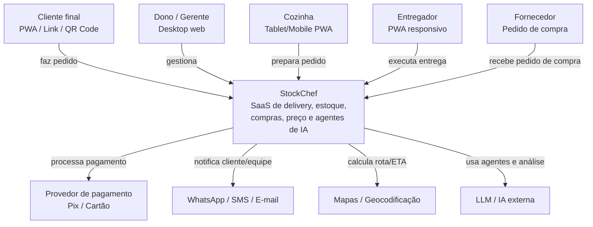
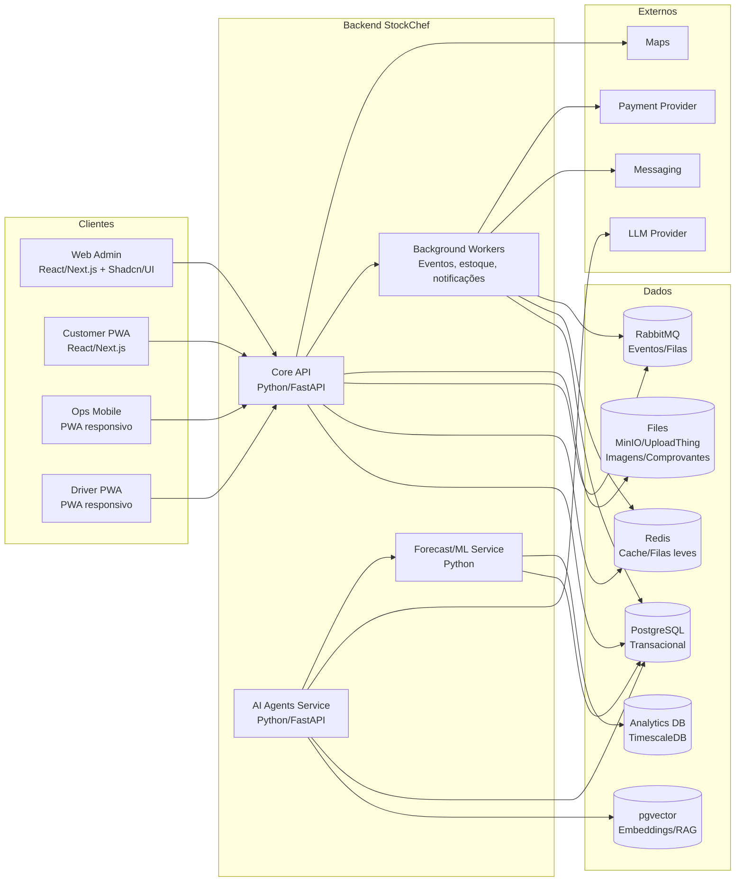
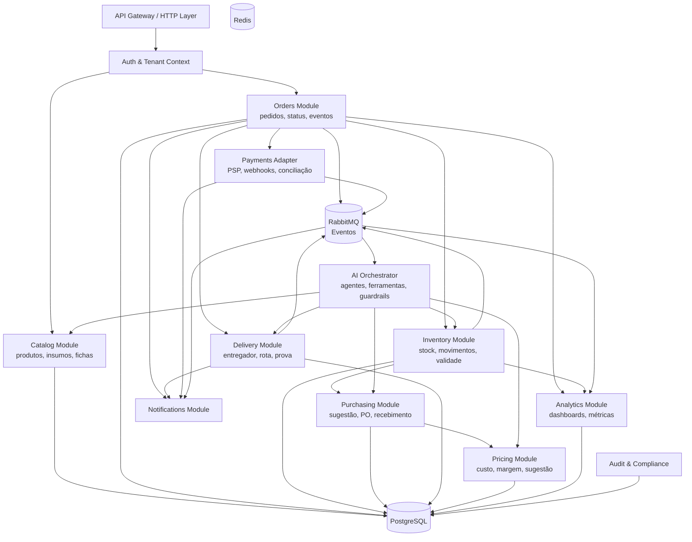

Perfeito. Segue o **Pacote de Execução v1** do projeto, já em formato acionável para produto, engenharia, dados, comercial e captação.

Incluo:

1. **Backlog completo em CSV para importação no Jira/Linear/Trello**
2. **User stories em BDD/Gherkin para os fluxos críticos**
3. **Modelo de dados em PostgreSQL DDL para o MVP**
4. **Diagramas C4 em Mermaid**
5. **Pitch deck slide a slide com textos prontos**
6. **Plano financeiro simplificado para 24 meses**
7. **Próximos passos de execução**

Nome do projeto: **StockChef**.

---

# 1. Backlog Ágil em CSV para importação

Salve o conteúdo abaixo como `stockchef_backlog.csv` em encoding **UTF-8**.
No Jira, use importador CSV e mapeie as colunas conforme seu projeto.

```csv
"Issue Type","Summary","Epic","Priority","Story Points","Description","Acceptance Criteria","Labels"
"Story","US001 - Criar conta","E01 - Fundação e Multi-tenancy","Must","3","Como visitante, quero criar minha conta para acessar o sistema.","Cadastro com e-mail e senha | Validação de campos | Envio de verificação por e-mail | Usuário fica pendente até confirmar","mvp,auth,onboarding"
"Story","US002 - Login seguro","E01 - Fundação e Multi-tenancy","Must","3","Como usuário, quero fazer login com segurança.","Login com e-mail e senha | Recuperação de senha | Sessão segura | Bloqueio após tentativas inválidas","mvp,auth,security"
"Story","US003 - Criar loja","E01 - Fundação e Multi-tenancy","Must","3","Como owner, quero criar minha loja.","Nome | Endereço | Telefone | Horário | Logo | Status ativo/inativo","mvp,store,onboarding"
"Story","US004 - Convidar usuários","E01 - Fundação e Multi-tenancy","Must","5","Como owner, quero convidar usuários e definir papéis.","Convite por e-mail | Papéis: owner, manager, cashier, kitchen, buyer, driver, support | Revogação | Pendências","mvp,rbac,users"
"Story","US005 - Isolamento por tenant","E01 - Fundação e Multi-tenancy","Must","5","Como sistema, devo isolar dados por tenant.","Nenhuma consulta retorna dado de outro tenant | Tenant context obrigatório | Testes automatizados de isolamento","mvp,multitenancy,security"
"Story","US006 - Admin SaaS vê tenants","E01 - Fundação e Multi-tenancy","Should","3","Como admin SaaS, quero visualizar tenants e status.","Lista de tenants | Filtros | Status | Suspensão/reativação | Uso básico","saas,admin"
"Story","US007 - Cadastrar insumo","E02 - Cadastros Operacionais","Must","3","Como comprador, quero cadastrar insumos.","Nome | Unidade | Categoria | Custo | Fornecedor padrão | Estoque mínimo | Validade","mvp,inventory,catalog"
"Story","US008 - Unidades e conversões","E02 - Cadastros Operacionais","Must","5","Como comprador, quero cadastrar unidades e conversões.","kg, g, L, ml, un, pacote | Conversão válida | Impedir conversão incompatível","mvp,units,inventory"
"Story","US009 - Cadastrar fornecedor","E02 - Cadastros Operacionais","Must","3","Como comprador, quero cadastrar fornecedores.","Nome | Contato | Documento | Lead time | Pedido mínimo | Status","mvp,supplier,purchasing"
"Story","US010 - Importar CSV","E02 - Cadastros Operacionais","Should","5","Como gerente, quero importar cadastros via CSV.","Template disponível | Validação linha a linha | Relatório de erros | Importação parcial ou total","onboarding,import"
"Story","US011 - Validar unidade do insumo","E02 - Cadastros Operacionais","Must","2","Como sistema, devo impedir insumo sem unidade válida.","Erro ao salvar sem unidade | Unidade obrigatória | Mensagem clara","validation,inventory"
"Story","US012 - Cadastrar produto","E03 - Produtos e Ficha Técnica","Must","3","Como gerente, quero cadastrar produtos.","Nome | Categoria | Preço | Descrição | Foto | Disponibilidade","mvp,product,catalog"
"Story","US013 - Adicionais e variações","E03 - Produtos e Ficha Técnica","Should","5","Como gerente, quero criar adicionais e variações.","Grupo de adicionais | Cobrado/não cobrado | Obrigatório/opcional | Mínimo/máximo de seleção","product,modifiers"
"Story","US014 - Montar ficha técnica","E03 - Produtos e Ficha Técnica","Must","8","Como chef, quero montar ficha técnica do produto.","Selecionar insumos | Quantidades | Unidades | Salvar versão | Validar tenant","mvp,recipe,inventory"
"Story","US015 - Calcular custo do produto","E03 - Produtos e Ficha Técnica","Must","5","Como sistema, devo calcular custo do produto pela ficha técnica.","Soma de insumos × quantidade × custo unitário | Considerar waste factor | Exibir custo","mvp,costing,recipe"
"Story","US016 - Alertar produto sem ficha","E03 - Produtos e Ficha Técnica","Must","2","Como gerente, quero ver produto sem ficha técnica.","Alerta no cadastro | Alerta no dashboard | Bloqueio opcional de venda","onboarding,data-quality"
"Story","US017 - Histórico de ficha técnica","E03 - Produtos e Ficha Técnica","Could","5","Como sistema, devo manter histórico de versões da ficha técnica.","Versão | Data | Usuário | Alterações | Restauração futura","recipe,audit"
"Story","US018 - Acessar cardápio via link","E04 - Cardápio Digital e Checkout","Must","5","Como cliente, quero acessar cardápio via link/QR code.","Página responsiva | Carregamento rápido | Sem login obrigatório | Loja correta","mvp,pwa,customer"
"Story","US019 - Navegar categorias","E04 - Cardápio Digital e Checkout","Must","3","Como cliente, quero navegar por categorias e produtos.","Busca | Filtros | Fotos | Descrição | Preço","pwa,catalog"
"Story","US020 - Carrinho","E04 - Cardápio Digital e Checkout","Must","5","Como cliente, quero adicionar itens ao carrinho.","Quantidade | Adicionais | Observação | Remover | Editar","pwa,cart"
"Story","US021 - Endereço e horário","E04 - Cardápio Digital e Checkout","Must","8","Como cliente, quero informar endereço e escolher horário.","CEP | Mapa opcional | Retirada/delivery | Agendamento | Endereço salvo","pwa,checkout"
"Story","US022 - Taxa de entrega","E04 - Cardápio Digital e Checkout","Must","5","Como cliente, quero ver taxa de entrega calculada.","Por zona | Distância | Horário | Valor mínimo | Transparência no total","pwa,delivery,pricing"
"Story","US023 - Pagamento Pix/cartão","E04 - Cardápio Digital e Checkout","Must","13","Como cliente, quero pagar com Pix/cartão.","Integração PSP | Retorno de status | Confirmação | Tratamento de falha | Idempotência","mvp,payment,checkout"
"Story","US024 - Confirmação do pedido","E04 - Cardápio Digital e Checkout","Should","3","Como cliente, quero receber confirmação do pedido.","Número do pedido | E-mail/WhatsApp/push opcional | Resumo do pedido","notification,customer"
"Story","US025 - Ver pedidos em tempo real","E05 - Pedidos e Cozinha","Must","8","Como caixa, quero ver pedidos recebidos em tempo real.","Lista | Filtros | Notificação sonora | Atualização automática | Status","mvp,orders,realtime"
"Story","US026 - Fila de cozinha","E05 - Pedidos e Cozinha","Must","8","Como cozinha, quero ver fila de preparo.","Itens | Quantidades | Observações | Tempo | Status | Marcar pronto","mvp,kds,kitchen"
"Story","US027 - Mudar status do pedido","E05 - Pedidos e Cozinha","Must","5","Como usuário, quero mudar status do pedido.","Recebido → confirmado → preparo → pronto → entrega → concluído | Permissões","orders,status"
"Story","US028 - Registrar eventos do pedido","E05 - Pedidos e Cozinha","Must","3","Como sistema, devo registrar eventos do pedido.","Timestamp | Usuário | Status anterior/novo | Motivo | Payload","audit,events"
"Story","US029 - Cancelar pedido","E05 - Pedidos e Cozinha","Must","5","Como gerente, quero cancelar pedido com motivo.","Motivo obrigatório | Reembolso se aplicável | Baixa reversa | Auditoria","orders,cancellation"
"Story","US030 - Imprimir comanda","E05 - Pedidos e Cozinha","Should","5","Como caixa, quero imprimir comanda.","Template configurável | Impressora térmica ou PDF | Itens e observações","printing,pos"
"Story","US031 - Cadastrar entregador","E06 - Delivery Próprio","Must","3","Como gestor, quero cadastrar entregador.","Nome | Telefone | Documento | Veículo | Placa | Modelo de pagamento | Status","delivery,driver"
"Story","US032 - Atribuir pedido","E06 - Delivery Próprio","Must","5","Como despachante, quero atribuir pedido a entregador.","Lista de entregadores disponíveis | Atribuição manual | Notificação | Histórico","delivery,dispatch"
"Story","US033 - Entregador recebe pedido","E06 - Delivery Próprio","Must","8","Como entregador, quero receber pedidos atribuídos.","PWA | Notificação | Detalhes do pedido | Endereço | Contato","mobile,driver"
"Story","US034 - Atualizar status da entrega","E06 - Delivery Próprio","Must","5","Como entregador, quero atualizar status da entrega.","Saiu | Em rota | Entregue | Ocorrência | Offline básico","delivery,status"
"Story","US035 - Acompanhar entrega","E06 - Delivery Próprio","Should","5","Como cliente, quero acompanhar status da entrega.","Link de acompanhamento | ETA básico | Atualizações | Privacidade","customer,tracking"
"Story","US036 - Prova de entrega","E06 - Delivery Próprio","Must","5","Como sistema, devo exigir prova de entrega.","Foto | Assinatura | Código PIN | Registro | Impedir conclusão sem prova","delivery,proof"
"Story","US037 - Ocorrência de entrega","E06 - Delivery Próprio","Should","3","Como gestor, quero registrar ocorrência de entrega.","Endereço errado | Cliente não atende | Atraso | Avaria | Motivo","delivery,exception"
"Story","US038 - Desempenho por entregador","E06 - Delivery Próprio","Could","5","Como gestor, quero ver desempenho por entregador.","Entregas | Tempo médio | Atrasos | Avaliações | Ganho estimado","analytics,driver"
"Story","US039 - Baixa automática de estoque","E07 - Estoque","Must","13","Como sistema, devo dar baixa automática de insumos ao confirmar pedido.","Quantidade correta | Idempotência | Reversão em cancelamento | Snapshot da receita","mvp,inventory,orders"
"Story","US040 - Entrada de compra","E07 - Estoque","Must","8","Como estoquista, quero registrar entrada de compra.","Fornecedor | Itens | Quantidades | Custos | Lote | Validade","inventory,purchasing"
"Story","US041 - Registrar perda","E07 - Estoque","Must","5","Como estoquista, quero registrar perda.","Insumo | Quantidade | Motivo | Custo | Usuário | Auditoria","inventory,loss"
"Story","US042 - Ajustar inventário","E07 - Estoque","Must","5","Como estoquista, quero ajustar inventário.","Motivo obrigatório | Valor antes/depois | Auditoria | Permissão","inventory,adjustment"
"Story","US043 - Contagem mobile","E07 - Estoque","Should","8","Como gerente, quero fazer contagem mobile.","Lista de insumos | Digitação rápida | Salvar offline básico | Sincronização","mobile,inventory"
"Story","US044 - Alerta de estoque mínimo","E07 - Estoque","Must","3","Como sistema, devo alertar estoque mínimo.","Notificação no painel | Mobile | Threshold configurável | Prioridade","alert,inventory"
"Story","US045 - Alerta de validade","E07 - Estoque","Must","5","Como sistema, devo alertar validade próxima.","Regras configuráveis: 3, 7, 15 dias | Lote | FEFO sugerido","alert,expiry"
"Story","US046 - Custo médio ponderado","E07 - Estoque","Must","8","Como sistema, devo calcular custo médio ponderado móvel.","Atualização em entrada | Correção em ajuste | Impacto no custo do prato","costing,inventory"
"Story","US047 - Sugestão de compra","E08 - Compras","Must","13","Como comprador, quero ver sugestão de compra.","Insumo | Quantidade sugerida | Motivo | Fornecedor | Risco | Prioridade","mvp,purchasing,ai"
"Story","US048 - Pedido de compra","E08 - Compras","Must","5","Como comprador, quero transformar sugestão em pedido de compra.","Rascunho | Edição | Aprovação | Status | Histórico","purchasing,po"
"Story","US049 - Aprovar compra","E08 - Compras","Should","5","Como gestor, quero aprovar compra acima de limite.","Valor limite | Aprovação obrigatória | Notificação | Auditoria","approval,purchasing"
"Story","US050 - Recebimento de compra","E08 - Compras","Must","8","Como estoquista, quero registrar recebimento de pedido de compra.","Parcial/total | Divergência | Custo real | Lote | Validade","receiving,purchasing"
"Story","US051 - Histórico de preço","E08 - Compras","Could","5","Como comprador, quero ver histórico de preço por fornecedor.","Gráfico simples | Variação | Última compra | Fornecedor","analytics,supplier"
"Story","US052 - Custo real do prato","E09 - Precificação","Must","8","Como gestor, quero ver custo real do prato.","Insumos | Embalagem | Taxa de pagamento opcional | Perda média | CMV","pricing,costing"
"Story","US053 - Margem alvo","E09 - Precificação","Must","3","Como gestor, quero definir margem alvo por produto/categoria.","Configuração salva | Aplicação na sugestão | Override por produto","pricing,margin"
"Story","US054 - Sugerir faixa de preço","E09 - Precificação","Must","5","Como sistema, devo sugerir faixa de preço.","Custo + margem alvo | Arredondamento psicológico | Explicação","pricing,ai"
"Story","US055 - Simular novo preço","E09 - Precificação","Should","8","Como gestor, quero simular impacto de novo preço.","Margem antiga/nova | Volume estimado | Receita estimada | Cenários","pricing,simulation"
"Story","US056 - Aplicar preço sugerido","E09 - Precificação","Must","3","Como gestor, quero aplicar preço sugerido com aprovação.","Mudança registrada | Histórico | Notificação | Bloqueio de autoaplicação","pricing,approval"
"Story","US057 - Dashboard de vendas","E10 - Analytics","Must","8","Como dono, quero dashboard de vendas.","Período | Canal | Produto | Categoria | Ticket médio | Evolução","analytics,sales"
"Story","US058 - Dashboard de margem","E10 - Analytics","Must","8","Como dono, quero dashboard de margem por prato.","Receita | CMV | Margem absoluta | Margem percentual | Ranking","analytics,margin"
"Story","US059 - Rupturas e perdas","E10 - Analytics","Must","5","Como gestor, quero ver rupturas e perdas.","Insumos faltantes | Motivos | Impacto estimado | Tendência","analytics,inventory"
"Story","US060 - Desempenho de delivery","E10 - Analytics","Should","5","Como gestor, quero ver desempenho de delivery.","Tempo médio | Atrasos | Entregador | Zona | Cancelamentos","analytics,delivery"
"Story","US061 - Métricas de uso por tenant","E10 - Analytics","Should","5","Como admin SaaS, quero métricas de uso por tenant.","Logins | Pedidos | IA | Estoque | Features | Saúde da conta","saas,analytics"
"Story","US062 - Perguntar sobre dados","E11 - Agente de IA","Must","13","Como gestor, quero perguntar sobre meus dados em linguagem natural.","Resposta baseada apenas no tenant | Fonte | Sem hallucination crítica | Limites","ai,nlq"
"Story","US063 - Resumo diário","E11 - Agente de IA","Should","8","Como gestor, quero resumo diário por e-mail/WhatsApp.","Vendas | Alertas | Estoque crítico | Sugestões | Horário configurável","ai,notification"
"Story","US064 - Agente estoquista","E11 - Agente de IA","Must","13","Como sistema, agente estoquista deve gerar sugestão de compra explicada.","Motivo | Dados usados | Confiança | Ação aprovável | Log","ai,stock,agent"
"Story","US065 - Aprovar/rejeitar IA","E11 - Agente de IA","Must","5","Como gestor, quero aprovar/rejeitar recomendação da IA.","Feedback salvo | Impacto no modelo | Auditoria | Undo futuro","ai,feedback"
"Story","US066 - Auditar agente","E11 - Agente de IA","Must","8","Como admin, quero auditar ações do agente.","Prompt | Ferramentas | Resposta | Usuário | Timestamp | Tenant","ai,audit,security"
"Story","US067 - Guardrail de ação crítica","E11 - Agente de IA","Must","5","Como sistema, devo impedir ação crítica da IA sem aprovação.","Compra | Preço | Reembolso | Comunicação em massa | Confirmation required","ai,guardrail"
"Story","US068 - Assinar plano","E12 - Billing e Administração SaaS","Should","8","Como owner, quero assinar um plano.","Checkout | Trial | Upgrade/downgrade | Status da assinatura","billing,saas"
"Story","US069 - Limites por plano","E12 - Billing e Administração SaaS","Should","5","Como sistema, devo aplicar limites por plano.","Usuários | Lojas | Pedidos | IA | Storage | Aviso antes do bloqueio","billing,entitlement"
"Story","US070 - Suspender conta","E12 - Billing e Administração SaaS","Should","3","Como admin SaaS, quero suspender conta por inadimplência.","Aviso | Suspensão | Reativação | Auditoria","billing,admin"
"Story","US071 - Baixar nota da assinatura","E12 - Billing e Administração SaaS","Could","3","Como owner, quero baixar notas fiscais da assinatura.","Integração futura ou manual no MVP | Histórico de faturas","billing,invoice"
```

---

# 2. User Stories críticas em BDD/Gherkin

Abaixo estão os cenários mais importantes para garantir confiança no MVP, especialmente nos fluxos de **estoque, pagamento, entrega, compra, preço e IA**.

```gherkin
Feature: Isolamento multi-tenant
  Como proprietário de um restaurante
  Quero que meus dados fiquem isolados de outros clientes
  Para garantir segurança e conformidade

  Scenario: Usuário não acessa dados de outro tenant
    Given que o tenant "Pizzaria Norte" existe
    And que o tenant "Hamburgueria Sul" existe
    And que um usuário pertence ao tenant "Pizzaria Norte"
    When o usuário tenta listar pedidos do tenant "Hamburgueria Sul"
    Then o sistema deve retornar erro 403
    And nenhum dado do tenant "Hamburgueria Sul" deve ser exposto
```

```gherkin
Feature: Ficha técnica e custo do prato
  Como gerente
  Quero calcular o custo real de cada prato
  Para definir preço com margem consciente

  Scenario: Calcular custo do X-Burger
    Given que o insumo "Queijo cheddar" custa R$ 45,00 por kg
    And que o produto "X-Burger" possui ficha técnica com 30 g de queijo
    When o sistema calcular o custo do produto
    Then o custo do queijo deve ser R$ 1,35
    And o custo total deve considerar todos os insumos da ficha técnica
```

```gherkin
Feature: Baixa automática de estoque
  Como dono do restaurante
  Quero que o estoque seja atualizado automaticamente quando um pedido for confirmado
  Para evitar ruptura e divergência

  Scenario: Confirmar pedido dá baixa no estoque
    Given que o estoque de "Queijo cheddar" é 3,000 kg
    And que o produto "X-Burger" usa 0,030 kg de queijo
    When um pedido com 2 unidades de "X-Burger" for confirmado
    Then o estoque de "Queijo cheddar" deve passar para 2,940 kg
    And uma movimentação de estoque do tipo "sale" deve ser criada
    And a movimentação deve ser idempotente

  Scenario: Cancelar pedido reverte baixa
    Given que um pedido confirmado causou baixa de estoque
    When o pedido for cancelado
    Then o sistema deve criar movimentação de reversão
    And o estoque deve retornar ao valor anterior
    And o evento deve ser auditado
```

```gherkin
Feature: Pagamento com idempotência
  Como cliente
  Quero pagar meu pedido com segurança
  Para não sofrer cobrança duplicada

  Scenario: Webhook de pagamento processado duas vezes
    Given que um pedido aguarda pagamento
    When o PSP envia webhook de pagamento aprovado duas vezes com o mesmo provider_payment_id
    Then o sistema deve processar apenas uma vez
    And o pedido deve ficar confirmado apenas uma vez
    And a baixa de estoque deve ocorrer apenas uma vez
```

```gherkin
Feature: Entrega própria com prova de entrega
  Como gestor
  Quero garantir que o entregador confirme a entrega
  Para reduzir disputas e melhorar experiência do cliente

  Scenario: Entregador conclui entrega com foto
    Given que uma entrega está com status "in_transit"
    When o entregador anexa foto da entrega
    And informa "entregue"
    Then a entrega deve mudar para "delivered"
    And o pedido deve mudar para "completed"
    And a prova de entrega deve ser armazenada
    And o cliente deve receber notificação de conclusão
```

```gherkin
Feature: Sugestão de compra explicável
  Como comprador
  Quero saber o que comprar e por quê
  Para reduzir ruptura sem comprar em excesso

  Scenario: Gerar sugestão de compra para queijo
    Given que o estoque atual de "Queijo cheddar" é 1,100 kg
    And que a previsão de consumo para os próximos 3 dias é 4,200 kg
    And que o lead time do fornecedor é 1 dia
    And que o estoque de segurança recomendado é 1,500 kg
    When o sistema gera sugestão de compra
    Then a quantidade sugerida deve ser suficiente para cobrir consumo, lead time e segurança
    And a sugestão deve exibir explicação com dados usados
    And o comprador deve poder aprovar, editar ou rejeitar
```

```gherkin
Feature: Precificação assistida com aprovação humana
  Como dono
  Quero sugestões de preço sem perder controle
  Para melhorar margem com segurança

  Scenario: IA sugere novo preço mas não aplica automaticamente
    Given que o prato "X-Burger" tem margem abaixo do alvo
    And que o agente precificador gera sugestão de preço R$ 29,90
    When a sugestão é apresentada
    Then o preço atual não deve ser alterado
    And o gestor deve aprovar explicitamente
    And a alteração deve ser registrada em audit log
```

```gherkin
Feature: Agente de IA grounded no tenant
  Como gestor
  Quero perguntar sobre meus dados sem risco de hallucination
  Para tomar decisões rápidas

  Scenario: Pergunta sobre estoque crítico
    Given que o usuário está autenticado no tenant "Hamburgueria Central"
    When ele pergunta "quais insumos estão abaixo do mínimo?"
    Then a resposta deve usar apenas dados do tenant "Hamburgueria Central"
    And deve listar insumos, quantidade atual e mínimo
    And deve citar a fonte dos dados
    And não deve inventar insumos inexistentes
```

```gherkin
Feature: Inventário offline básico
  Como estoquista
  Quero contar estoque mesmo sem internet estável
  Para manter operação contínua

  Scenario: Contagem offline sincroniza depois
    Given que o dispositivo do estoquista está offline
    When ele registra contagem de 3 insumos
    And a conexão retorna
    Then o sistema deve sincronizar as contagens
    And resolver conflitos com timestamp ou revisão manual
    And gerar ajustes de inventário auditáveis
```

```gherkin
Feature: Guardrail para ações sensíveis de IA
  Como administrador do SaaS
  Quero que agentes de IA não executem ações críticas sozinhos
  Para evitar prejuízo financeiro e perda de confiança

  Scenario: Agente tenta criar pedido de compra automaticamente
    Given que o agente estoquista identifica necessidade de compra
    When ele tenta criar pedido de compra sem aprovação
    Then o sistema deve bloquear a execução direta
    And deve criar apenas uma recomendação pendente
    And deve exigir aprovação humana
```

---

# 3. Modelo de dados PostgreSQL — DDL do MVP

Este DDL representa o **núcleo transacional** do StockChef. Ele pode evoluir para analytics, ML e agentes, mas já suporta:

- multi-tenancy;
- usuários e papéis simples;
- lojas;
- clientes;
- fornecedores;
- insumos;
- unidades e conversões;
- estoque;
- produtos;
- fichas técnicas;
- pedidos;
- pagamentos;
- entregas;
- compras;
- perdas;
- inventário;
- previsões;
- recomendações de IA;
- auditoria.

> Recomendação: use `tenant_id` em todas as tabelas de negócio e aplique Row-Level Security ou filtro obrigatório na camada de repositório.

```sql
-- =========================================================
-- StockChef - PostgreSQL DDL MVP
-- Multi-tenant core schema
-- =========================================================

create extension if not exists pgcrypto;

-- =========================================================
-- Plans and tenants
-- =========================================================

create table plans (
  id uuid primary key default gen_random_uuid(),
  code text not null unique,
  name text not null,
  price_monthly numeric(14,2) not null default 0,
  included_orders integer not null default 0,
  overage_fee numeric(14,2) not null default 0,
  ai_enabled boolean not null default false,
  max_users integer,
  max_stores integer,
  created_at timestamptz not null default now(),
  updated_at timestamptz not null default now()
);

create table tenants (
  id uuid primary key default gen_random_uuid(),
  plan_id uuid references plans(id),
  name text not null,
  slug text not null unique,
  status text not null default 'active'
    check (status in ('active','trial','suspended','canceled')),
  created_at timestamptz not null default now(),
  updated_at timestamptz not null default now()
);

create table subscriptions (
  id uuid primary key default gen_random_uuid(),
  tenant_id uuid not null references tenants(id) on delete cascade,
  plan_id uuid not null references plans(id),
  status text not null default 'active'
    check (status in ('trial','active','past_due','canceled','paused')),
  start_date date not null default current_date,
  end_date date,
  trial_ends_at timestamptz,
  external_subscription_id text,
  created_at timestamptz not null default now(),
  updated_at timestamptz not null default now()
);

-- =========================================================
-- Users and access
-- =========================================================

create table users (
  id uuid primary key default gen_random_uuid(),
  tenant_id uuid references tenants(id) on delete cascade,
  email text not null,
  password_hash text not null,
  name text not null,
  phone text,
  role text not null default 'manager'
    check (role in ('owner','manager','cashier','kitchen','buyer','driver','support','admin_saas')),
  status text not null default 'active'
    check (status in ('pending','active','invited','disabled')),
  mfa_enabled boolean not null default false,
  last_login_at timestamptz,
  created_at timestamptz not null default now(),
  updated_at timestamptz not null default now(),
  unique (tenant_id, email)
);

create index idx_users_tenant_status on users(tenant_id, status);

-- =========================================================
-- Stores and customers
-- =========================================================

create table stores (
  id uuid primary key default gen_random_uuid(),
  tenant_id uuid not null references tenants(id) on delete cascade,
  name text not null,
  address jsonb not null default '{}'::jsonb,
  phone text,
  email text,
  opening_hours jsonb not null default '{}'::jsonb,
  delivery_enabled boolean not null default true,
  pickup_enabled boolean not null default true,
  status text not null default 'active'
    check (status in ('active','inactive','archived')),
  created_at timestamptz not null default now(),
  updated_at timestamptz not null default now()
);

create index idx_stores_tenant on stores(tenant_id, status);

create table customers (
  id uuid primary key default gen_random_uuid(),
  tenant_id uuid not null references tenants(id) on delete cascade,
  name text,
  phone text,
  email text,
  address jsonb not null default '{}'::jsonb,
  created_at timestamptz not null default now(),
  updated_at timestamptz not null default now()
);

create index idx_customers_tenant_phone on customers(tenant_id, phone);
create index idx_customers_tenant_email on customers(tenant_id, email);

-- =========================================================
-- Suppliers, units, ingredients
-- =========================================================

create table suppliers (
  id uuid primary key default gen_random_uuid(),
  tenant_id uuid not null references tenants(id) on delete cascade,
  name text not null,
  document text,
  contact_name text,
  email text,
  phone text,
  lead_time_days integer not null default 1,
  minimum_order_value numeric(14,2) not null default 0,
  status text not null default 'active'
    check (status in ('active','inactive','archived')),
  created_at timestamptz not null default now(),
  updated_at timestamptz not null default now()
);

create index idx_suppliers_tenant on suppliers(tenant_id, status);

create table units (
  id uuid primary key default gen_random_uuid(),
  tenant_id uuid not null references tenants(id) on delete cascade,
  name text not null,
  symbol text not null,
  type text not null default 'count'
    check (type in ('mass','volume','count','length','time','other')),
  created_at timestamptz not null default now(),
  updated_at timestamptz not null default now(),
  unique (tenant_id, symbol)
);

create table unit_conversions (
  id uuid primary key default gen_random_uuid(),
  tenant_id uuid not null references tenants(id) on delete cascade,
  from_unit_id uuid not null references units(id),
  to_unit_id uuid not null references units(id),
  factor numeric(18,8) not null check (factor > 0),
  comment text,
  created_at timestamptz not null default now(),
  unique (tenant_id, from_unit_id, to_unit_id)
);

create table ingredients (
  id uuid primary key default gen_random_uuid(),
  tenant_id uuid not null references tenants(id) on delete cascade,
  name text not null,
  category text,
  base_unit_id uuid not null references units(id),
  default_supplier_id uuid references suppliers(id),
  average_cost numeric(14,4) not null default 0 check (average_cost >= 0),
  minimum_stock numeric(14,4) not null default 0 check (minimum_stock >= 0),
  maximum_stock numeric(14,4) check (maximum_stock is null or maximum_stock >= 0),
  shelf_life_days integer check (shelf_life_days is null or shelf_life_days >= 0),
  waste_factor numeric(6,4) not null default 0 check (waste_factor >= 0 and waste_factor <= 1),
  status text not null default 'active'
    check (status in ('active','inactive','archived')),
  created_at timestamptz not null default now(),
  updated_at timestamptz not null default now(),
  unique (tenant_id, name)
);

create index idx_ingredients_tenant_status on ingredients(tenant_id, status);
create index idx_ingredients_supplier on ingredients(default_supplier_id);

-- =========================================================
-- Stock
-- =========================================================

create table stock_levels (
  id uuid primary key default gen_random_uuid(),
  tenant_id uuid not null references tenants(id) on delete cascade,
  store_id uuid not null references stores(id) on delete cascade,
  ingredient_id uuid not null references ingredients(id) on delete cascade,
  quantity numeric(14,4) not null default 0 check (quantity >= 0),
  average_cost numeric(14,4) not null default 0 check (average_cost >= 0),
  last_counted_at timestamptz,
  created_at timestamptz not null default now(),
  updated_at timestamptz not null default now(),
  unique (store_id, ingredient_id)
);

create index idx_stock_levels_tenant_store on stock_levels(tenant_id, store_id);
create index idx_stock_levels_low_stock on stock_levels(tenant_id, store_id, quantity);

create table stock_movements (
  id uuid primary key default gen_random_uuid(),
  tenant_id uuid not null references tenants(id) on delete cascade,
  store_id uuid not null references stores(id) on delete cascade,
  ingredient_id uuid not null references ingredients(id) on delete cascade,
  type text not null
    check (type in ('purchase','sale','loss','adjustment','transfer','return','reservation','release','reversal')),
  quantity numeric(14,4) not null,
  unit_cost numeric(14,4) not null default 0 check (unit_cost >= 0),
  reference_type text,
  reference_id uuid,
  reason text,
  idempotency_key text unique,
  user_id uuid references users(id),
  created_at timestamptz not null default now()
);

create index idx_stock_movements_lookup
  on stock_movements(tenant_id, store_id, ingredient_id, created_at desc);
create index idx_stock_movements_reference
  on stock_movements(reference_type, reference_id);

-- =========================================================
-- Catalog, products, recipes
-- =========================================================

create table categories (
  id uuid primary key default gen_random_uuid(),
  tenant_id uuid not null references tenants(id) on delete cascade,
  store_id uuid references stores(id) on delete cascade,
  name text not null,
  sort_order integer not null default 0,
  active boolean not null default true,
  created_at timestamptz not null default now(),
  updated_at timestamptz not null default now()
);

create index idx_categories_tenant_store on categories(tenant_id, store_id, active);

create table products (
  id uuid primary key default gen_random_uuid(),
  tenant_id uuid not null references tenants(id) on delete cascade,
  store_id uuid not null references stores(id) on delete cascade,
  category_id uuid references categories(id) on delete set null,
  name text not null,
  description text,
  price numeric(14,2) not null check (price >= 0),
  image_url text,
  active boolean not null default true,
  stock_control_enabled boolean not null default true,
  preparation_time_minutes integer not null default 10,
  created_at timestamptz not null default now(),
  updated_at timestamptz not null default now(),
  unique (store_id, name)
);

create index idx_products_tenant_store_active on products(tenant_id, store_id, active);

create table product_modifiers (
  id uuid primary key default gen_random_uuid(),
  tenant_id uuid not null references tenants(id) on delete cascade,
  product_id uuid not null references products(id) on delete cascade,
  group_name text not null,
  modifier_name text not null,
  price_delta numeric(14,2) not null default 0,
  required boolean not null default false,
  min_selection integer not null default 0,
  max_selection integer,
  active boolean not null default true,
  created_at timestamptz not null default now(),
  updated_at timestamptz not null default now()
);

create index idx_product_modifiers_product on product_modifiers(product_id, active);

create table recipes (
  id uuid primary key default gen_random_uuid(),
  tenant_id uuid not null references tenants(id) on delete cascade,
  product_id uuid not null references products(id) on delete cascade,
  version integer not null default 1,
  status text not null default 'draft'
    check (status in ('draft','active','archived')),
  effective_from timestamptz not null default now(),
  created_by uuid references users(id),
  created_at timestamptz not null default now(),
  updated_at timestamptz not null default now(),
  unique (product_id, version)
);

create index idx_recipes_product_status on recipes(product_id, status);

create table recipe_items (
  id uuid primary key default gen_random_uuid(),
  tenant_id uuid not null references tenants(id) on delete cascade,
  recipe_id uuid not null references recipes(id) on delete cascade,
  ingredient_id uuid not null references ingredients(id) on delete restrict,
  quantity numeric(14,4) not null check (quantity > 0),
  unit_id uuid not null references units(id),
  waste_factor numeric(6,4) not null default 0 check (waste_factor >= 0 and waste_factor <= 1),
  optional boolean not null default false,
  created_at timestamptz not null default now(),
  updated_at timestamptz not null default now()
);

create index idx_recipe_items_recipe on recipe_items(recipe_id);
create index idx_recipe_items_ingredient on recipe_items(ingredient_id);

-- =========================================================
-- Delivery zones and drivers
-- =========================================================

create table zones (
  id uuid primary key default gen_random_uuid(),
  tenant_id uuid not null references tenants(id) on delete cascade,
  store_id uuid not null references stores(id) on delete cascade,
  name text not null,
  geometry jsonb not null default '{}'::jsonb,
  cep_ranges jsonb not null default '[]'::jsonb,
  delivery_fee numeric(14,2) not null default 0 check (delivery_fee >= 0),
  min_order_value numeric(14,2) not null default 0 check (min_order_value >= 0),
  eta_minutes integer not null default 30,
  active boolean not null default true,
  created_at timestamptz not null default now(),
  updated_at timestamptz not null default now()
);

create index idx_zones_store_active on zones(store_id, active);

create table drivers (
  id uuid primary key default gen_random_uuid(),
  tenant_id uuid not null references tenants(id) on delete cascade,
  name text not null,
  phone text not null,
  document text,
  vehicle_type text not null default 'motorcycle'
    check (vehicle_type in ('motorcycle','bicycle','car','van','other')),
  plate text,
  payment_model text not null default 'per_delivery'
    check (payment_model in ('per_delivery','hourly','monthly','fixed_route')),
  status text not null default 'active'
    check (status in ('active','inactive','suspended')),
  rating_average numeric(4,2) not null default 5 check (rating_average >= 0 and rating_average <= 5),
  created_at timestamptz not null default now(),
  updated_at timestamptz not null default now()
);

create index idx_drivers_tenant_status on drivers(tenant_id, status);

-- =========================================================
-- Orders
-- =========================================================

create table orders (
  id uuid primary key default gen_random_uuid(),
  tenant_id uuid not null references tenants(id) on delete cascade,
  store_id uuid not null references stores(id) on delete cascade,
  customer_id uuid references customers(id) on delete set null,
  code text not null,
  status text not null default 'received'
    check (status in ('received','confirmed','preparing','ready','out_for_delivery','delivered','completed','cancelled','refunded')),
  channel text not null default 'own_pwa'
    check (channel in ('own_pwa','whatsapp','phone','pos','marketplace_future')),
  fulfillment_type text not null default 'delivery'
    check (fulfillment_type in ('delivery','pickup','table')),
  subtotal numeric(14,2) not null default 0 check (subtotal >= 0),
  delivery_fee numeric(14,2) not null default 0 check (delivery_fee >= 0),
  discount_total numeric(14,2) not null default 0 check (discount_total >= 0),
  tax_total numeric(14,2) not null default 0 check (tax_total >= 0),
  total numeric(14,2) not null default 0 check (total >= 0),
  expected_time timestamptz,
  notes text,
  created_at timestamptz not null default now(),
  updated_at timestamptz not null default now(),
  unique (tenant_id, store_id, code)
);

create index idx_orders_tenant_store_created on orders(tenant_id, store_id, created_at desc);
create index idx_orders_status on orders(tenant_id, status, created_at desc);

create table order_items (
  id uuid primary key default gen_random_uuid(),
  tenant_id uuid not null references tenants(id) on delete cascade,
  order_id uuid not null references orders(id) on delete cascade,
  product_id uuid not null references products(id) on delete restrict,
  quantity integer not null check (quantity > 0),
  unit_price numeric(14,2) not null check (unit_price >= 0),
  total_price numeric(14,2) not null check (total_price >= 0),
  modifiers jsonb not null default '[]'::jsonb,
  notes text,
  recipe_snapshot jsonb not null default '{}'::jsonb,
  created_at timestamptz not null default now()
);

create index idx_order_items_order on order_items(order_id);
create index idx_order_items_product on order_items(product_id);

create table order_events (
  id uuid primary key default gen_random_uuid(),
  tenant_id uuid not null references tenants(id) on delete cascade,
  order_id uuid not null references orders(id) on delete cascade,
  event_type text not null,
  from_status text,
  to_status text,
  user_id uuid references users(id),
  payload jsonb not null default '{}'::jsonb,
  created_at timestamptz not null default now()
);

create index idx_order_events_order on order_events(order_id, created_at);

-- =========================================================
-- Payments
-- =========================================================

create table payments (
  id uuid primary key default gen_random_uuid(),
  tenant_id uuid not null references tenants(id) on delete cascade,
  order_id uuid not null references orders(id) on delete cascade,
  provider text not null,
  provider_payment_id text unique,
  method text not null
    check (method in ('pix','credit_card','debit_card','cash','voucher')),
  amount numeric(14,2) not null check (amount >= 0),
  status text not null default 'pending'
    check (status in ('pending','authorized','captured','failed','refunded','partially_refunded')),
  idempotency_key text unique,
  raw_response jsonb not null default '{}'::jsonb,
  created_at timestamptz not null default now(),
  updated_at timestamptz not null default now()
);

create index idx_payments_order on payments(order_id, status);
create index idx_payments_tenant_provider on payments(tenant_id, provider, created_at desc);

-- =========================================================
-- Deliveries
-- =========================================================

create table deliveries (
  id uuid primary key default gen_random_uuid(),
  tenant_id uuid not null references tenants(id) on delete cascade,
  order_id uuid not null unique references orders(id) on delete cascade,
  driver_id uuid references drivers(id) on delete set null,
  status text not null default 'pending'
    check (status in ('pending','assigned','picked_up','in_transit','delivered','failed','canceled')),
  assigned_at timestamptz,
  picked_up_at timestamptz,
  delivered_at timestamptz,
  eta_minutes integer,
  route_hint jsonb not null default '{}'::jsonb,
  occurrence text,
  created_at timestamptz not null default now(),
  updated_at timestamptz not null default now()
);

create index idx_deliveries_tenant_status on deliveries(tenant_id, status, created_at desc);
create index idx_deliveries_driver on deliveries(driver_id, status);

create table proof_of_deliveries (
  id uuid primary key default gen_random_uuid(),
  tenant_id uuid not null references tenants(id) on delete cascade,
  delivery_id uuid not null references deliveries(id) on delete cascade,
  type text not null
    check (type in ('photo','signature','pin','customer_confirmation')),
  file_url text,
  received_by text,
  created_at timestamptz not null default now()
);

create index idx_proof_delivery on proof_of_deliveries(delivery_id);

-- =========================================================
-- Purchasing
-- =========================================================

create table purchase_orders (
  id uuid primary key default gen_random_uuid(),
  tenant_id uuid not null references tenants(id) on delete cascade,
  store_id uuid not null references stores(id) on delete cascade,
  supplier_id uuid not null references suppliers(id) on delete restrict,
  status text not null default 'draft'
    check (status in ('draft','sent','partially_received','received','canceled')),
  expected_date date,
  total_amount numeric(14,2) not null default 0 check (total_amount >= 0),
  created_by uuid references users(id),
  approved_by uuid references users(id),
  created_at timestamptz not null default now(),
  updated_at timestamptz not null default now()
);

create index idx_purchase_orders_tenant_status on purchase_orders(tenant_id, status, created_at desc);
create index idx_purchase_orders_supplier on purchase_orders(supplier_id, status);

create table purchase_order_items (
  id uuid primary key default gen_random_uuid(),
  tenant_id uuid not null references tenants(id) on delete cascade,
  purchase_order_id uuid not null references purchase_orders(id) on delete cascade,
  ingredient_id uuid not null references ingredients(id) on delete restrict,
  quantity numeric(14,4) not null check (quantity > 0),
  unit_id uuid not null references units(id),
  unit_cost numeric(14,4) not null check (unit_cost >= 0),
  received_quantity numeric(14,4) not null default 0 check (received_quantity >= 0),
  created_at timestamptz not null default now(),
  updated_at timestamptz not null default now()
);

create index idx_po_items_po on purchase_order_items(purchase_order_id);
create index idx_po_items_ingredient on purchase_order_items(ingredient_id);

create table goods_receipts (
  id uuid primary key default gen_random_uuid(),
  tenant_id uuid not null references tenants(id) on delete cascade,
  purchase_order_id uuid references purchase_orders(id) on delete set null,
  supplier_id uuid not null references suppliers(id) on delete restrict,
  received_at timestamptz not null default now(),
  received_by uuid references users(id),
  invoice_number text,
  notes text,
  created_at timestamptz not null default now()
);

create index idx_goods_receipts_supplier on goods_receipts(supplier_id, received_at desc);
create index idx_goods_receipts_po on goods_receipts(purchase_order_id);

create table goods_receipt_items (
  id uuid primary key default gen_random_uuid(),
  tenant_id uuid not null references tenants(id) on delete cascade,
  goods_receipt_id uuid not null references goods_receipts(id) on delete cascade,
  purchase_order_item_id uuid references purchase_order_items(id) on delete set null,
  ingredient_id uuid not null references ingredients(id) on delete restrict,
  quantity numeric(14,4) not null check (quantity > 0),
  unit_cost numeric(14,4) not null check (unit_cost >= 0),
  lot_code text,
  expires_at date,
  created_at timestamptz not null default now()
);

create index idx_gri_receipt on goods_receipt_items(goods_receipt_id);
create index idx_gri_ingredient on goods_receipt_items(ingredient_id);

-- =========================================================
-- Losses and inventory counts
-- =========================================================

create table losses (
  id uuid primary key default gen_random_uuid(),
  tenant_id uuid not null references tenants(id) on delete cascade,
  store_id uuid not null references stores(id) on delete cascade,
  ingredient_id uuid not null references ingredients(id) on delete restrict,
  quantity numeric(14,4) not null check (quantity > 0),
  cost numeric(14,2) not null default 0 check (cost >= 0),
  reason text not null default 'other'
    check (reason in ('expiration','cooking_error','damage','theft','return','spoilage','other')),
  occurred_at timestamptz not null default now(),
  registered_by uuid references users(id),
  created_at timestamptz not null default now()
);

create index idx_losses_tenant_store on losses(tenant_id, store_id, occurred_at desc);
create index idx_losses_ingredient on losses(ingredient_id, occurred_at desc);

create table inventory_counts (
  id uuid primary key default gen_random_uuid(),
  tenant_id uuid not null references tenants(id) on delete cascade,
  store_id uuid not null references stores(id) on delete cascade,
  status text not null default 'open'
    check (status in ('open','closed','canceled')),
  started_by uuid references users(id),
  started_at timestamptz not null default now(),
  closed_at timestamptz,
  notes text
);

create index idx_inventory_counts_store on inventory_counts(store_id, status, started_at desc);

create table inventory_count_items (
  id uuid primary key default gen_random_uuid(),
  tenant_id uuid not null references tenants(id) on delete cascade,
  inventory_count_id uuid not null references inventory_counts(id) on delete cascade,
  ingredient_id uuid not null references ingredients(id) on delete restrict,
  system_quantity numeric(14,4) not null default 0,
  counted_quantity numeric(14,4),
  difference numeric(14,4),
  adjusted boolean not null default false,
  note text,
  created_at timestamptz not null default now(),
  updated_at timestamptz not null default now()
);

create index idx_ici_count on inventory_count_items(inventory_count_id);
create index idx_ici_ingredient on inventory_count_items(ingredient_id);

-- =========================================================
-- Forecasts, recommendations, agents
-- =========================================================

create table forecasts (
  id uuid primary key default gen_random_uuid(),
  tenant_id uuid not null references tenants(id) on delete cascade,
  store_id uuid not null references stores(id) on delete cascade,
  entity_type text not null check (entity_type in ('product','ingredient')),
  entity_id uuid not null,
  horizon_date date not null,
  predicted_quantity numeric(14,4) not null check (predicted_quantity >= 0),
  confidence_interval_low numeric(14,4),
  confidence_interval_high numeric(14,4),
  model_version text not null,
  created_at timestamptz not null default now(),
  unique (tenant_id, store_id, entity_type, entity_id, horizon_date, model_version)
);

create index idx_forecasts_lookup on forecasts(tenant_id, store_id, entity_type, entity_id, horizon_date);

create table agent_runs (
  id uuid primary key default gen_random_uuid(),
  tenant_id uuid not null references tenants(id) on delete cascade,
  agent_type text not null
    check (agent_type in ('stock','pricing','delivery','support','finance','onboarding','data_quality')),
  trigger text not null
    check (trigger in ('schedule','user_prompt','event')),
  input_summary text,
  tools_used jsonb not null default '[]'::jsonb,
  output_summary text,
  status text not null default 'running'
    check (status in ('running','succeeded','failed','blocked')),
  started_at timestamptz not null default now(),
  finished_at timestamptz
);

create index idx_agent_runs_tenant on agent_runs(tenant_id, agent_type, started_at desc);

create table recommendations (
  id uuid primary key default gen_random_uuid(),
  tenant_id uuid not null references tenants(id) on delete cascade,
  store_id uuid references stores(id) on delete cascade,
  type text not null
    check (type in ('purchase','pricing','waste','delivery','menu','cashflow')),
  entity_id uuid,
  title text not null,
  message text not null,
  explanation jsonb not null default '{}'::jsonb,
  suggested_action jsonb not null default '{}'::jsonb,
  status text not null default 'pending'
    check (status in ('pending','accepted','rejected','expired','executed')),
  confidence numeric(5,4) check (confidence is null or (confidence >= 0 and confidence <= 1)),
  created_by_agent_run_id uuid references agent_runs(id) on delete set null,
  created_at timestamptz not null default now(),
  updated_at timestamptz not null default now()
);

create index idx_recommendations_tenant_status on recommendations(tenant_id, status, created_at desc);
create index idx_recommendations_type on recommendations(tenant_id, type, status);

-- =========================================================
-- Audit and usage
-- =========================================================

create table audit_logs (
  id uuid primary key default gen_random_uuid(),
  tenant_id uuid references tenants(id) on delete set null,
  user_id uuid references users(id) on delete set null,
  agent_run_id uuid references agent_runs(id) on delete set null,
  action text not null,
  entity_type text not null,
  entity_id uuid,
  before jsonb,
  after jsonb,
  ip inet,
  created_at timestamptz not null default now()
);

create index idx_audit_logs_tenant on audit_logs(tenant_id, created_at desc);
create index idx_audit_logs_entity on audit_logs(entity_type, entity_id);

create table usage_metrics (
  id uuid primary key default gen_random_uuid(),
  tenant_id uuid not null references tenants(id) on delete cascade,
  metric text not null,
  period_start date not null,
  period_end date not null,
  value numeric(18,4) not null default 0,
  created_at timestamptz not null default now(),
  unique (tenant_id, metric, period_start, period_end)
);

create index idx_usage_metrics_tenant on usage_metrics(tenant_id, metric, period_start desc);

-- =========================================================
-- Row Level Security example
-- =========================================================

-- Apply similar policies to all tenant-scoped tables in production.
-- The application must set: set local app.tenant_id = '<uuid>';

alter table orders enable row level security;

create policy tenant_isolation_orders
on orders
using (
  tenant_id = current_setting('app.tenant_id')::uuid
);

alter table order_items enable row level security;

create policy tenant_isolation_order_items
on order_items
using (
  tenant_id = current_setting('app.tenant_id')::uuid
);

alter table stock_levels enable row level security;

create policy tenant_isolation_stock_levels
on stock_levels
using (
  tenant_id = current_setting('app.tenant_id')::uuid
);

alter table recommendations enable row level security;

create policy tenant_isolation_recommendations
on recommendations
using (
  tenant_id = current_setting('app.tenant_id')::uuid
);
```

---

# 4. Arquitetura C4 — Diagramas

## 4.1 Nível 1 — System Context



---

## 4.2 Nível 2 — Container Diagram



---

## 4.3 Nível 3 — Component Diagram do Core API



---

# 5. Pitch para investidor — slide a slide

## Slide 1 — Capa

**StockChef**
Delivery próprio, estoque inteligente e agentes de IA para restaurantes.

**Subtítulo:**
Menos ruptura, menos desperdício, mais margem.

**Fala:**
“O StockChef é o sistema operacional de margem para pequenos negócios de alimentação que querem crescer com delivery próprio.”

---

## Slide 2 — Problema

Título: **Restaurantes pequenos operam no escuro**

Bullets:

- Não sabem o custo real de cada prato.
- Compram matéria-prima por intuição.
- Sofrem com falta de insumo em horário de pico.
- Desperdiçam por validade, erro de preparo e excesso de compra.
- Têm delivery próprio desorganizado.
- Pagam comissão alta em marketplace sem controle de margem.
- Gastam tempo em planilhas e tarefas manuais.

**Fala:**
“O problema não é só vender. É vender sabendo quanto custa, quanto sobra e o que precisa comprar amanhã.”

---

## Slide 3 — Solução

Título: **Um SaaS que conecta pedido, estoque, entrega, margem e IA**

Bullets:

- Cardápio digital e checkout próprio.
- Gestão de pedidos e cozinha.
- Delivery próprio com entregador, ETA e prova de entrega.
- Estoque por ficha técnica.
- Baixa automática de matéria-prima.
- Sugestão de compra explicável.
- Precificação assistida por custo, margem e demanda.
- Agentes de IA para estoques, entregas, atendimento e financeiro.

**Fala:**
“Não somos apenas um app de pedidos. Somos uma camada de inteligência operacional para o restaurante.”

---

## Slide 4 — Por que agora

Título: **A janela está aberta**

Bullets:

- Delivery próprio cresce como alternativa à dependência de marketplaces.
- Pequenos negócios precisam proteger margem, não apenas volume.
- IA ficou acessível para automatizar análise e rotina administrativa.
- Concorrentes focam em pedido/PDV, mas poucos conectam supply chain alimentar e decisão.
- Restaurantes já possuem dados suficientes para previsões simples de demanda.

**Fala:**
“Em 2026, IA aplicada à operação deixou de ser luxo. Virou vantagem competitiva para quem executa primeiro.”

---

## Slide 5 — Produto

Título: **Fluxo ponta a ponta**

Passos:

1. Cliente pede pelo PWA.
2. Pedido cai no painel e na cozinha.
3. Estoque dá baixa automática por ficha técnica.
4. Entregador recebe, executa e comprova entrega.
5. Sistema calcula margem real do prato.
6. IA sugere compra e preço com explicação.
7. Gestor aprova ações pelo mobile.

**Visual sugerido:** mockup com dashboard de margem, alerta de estoque e sugestão de compra.

**Fala:**
“Cada pedido alimenta o estoque, o custo, a previsão e a recomendação. O sistema aprende com a operação real.”

---

## Slide 6 — Mercado

Título: **Mercado amplo, fragmentado e mal atendido**

Bullets:

- Milhões de pequenos negócios de alimentação no Brasil.
- Alta mortalidade empresarial por gestão financeira e operacional frágil.
- Segmentos iniciais: hamburguerias, pizzarias, marmitarias, dark kitchens e cafeterias.
- Dor comum: estoque, CMV, ruptura, preço e delivery próprio.
- Disposição a pagar cresce quando o sistema mostra economia mensurável.

**Nota para deck:** inserir dados atualizados de IBGE, ABIA, Sebrae ou associações de food service no slide final.

**Fala:**
“Nosso beachhead não é ‘todo restaurante’. É o negócio que já faz ou quer fazer delivery próprio e precisa de margem.”

---

## Slide 7 — Modelo de negócio

Título: **Assinatura SaaS com valor baseado em margem**

Planos:

- **Essencial:** R$ 99 a R$ 199/mês.
- **Profissional:** R$ 299 a R$ 599/mês.
- **Enterprise/Franquia:** R$ 999+/mês ou sob consulta.

Receitas adicionais:

- Excedente por pedido.
- Add-on de IA avançada.
- Add-on de app nativo.
- Add-on de roteirização.
- Serviços de implantação.
- Futuro marketplace de fornecedores.

**Fala:**
“Cobramos recorrentemente porque entregamos valor recorrente: menos ruptura, menos desperdício e mais margem.”

---

## Slide 8 — Tração / plano de validação

Título: **Validação em 90 dias**

Metas:

- 20 entrevistas com restaurantes.
- 5 a 10 design partners.
- Protótipo navegável.
- MVP com pedido, estoque, delivery e sugestão de compra.
- 10 a 30 pilotos ativos.
- Métricas: acuracidade de estoque, redução de ruptura, adoção de sugestões, NPS.

Se já houver tração, substituir por:

- X cartas de interesse.
- Y pilotos assinados.
- Z pedidos processados.
- W redução média de ruptura observada.

**Fala:**
“Nosso objetivo não é lançar功能. É provar resultado financeiro em operação real.”

---

## Slide 9 — Concorrência

Título: **Posicionamento diferenciado**

Comparação:

| Solução | Ponto forte | Lacuna |
|---|---|---|
| iFood/Rappi | Demanda e logística | Comissão alta, pouca gestão de margem/estoque próprio |
| PDV tradicional | Caixa e fiscal | Fraco em IA, supply chain e delivery próprio inteligente |
| Planilhas | Flexibilidade | Fragilidade, retrabalho, sem automação |
| ERP | Completo | Caro e complexo para pequeno restaurante |
| StockChef | Operação + estoque + margem + IA | Precisa provar adoção e onboarding simples |

**Fala:**
“Não competimos apenas por pedido. Competimos por inteligência operacional e margem.”

---

## Slide 10 — Roadmap

Título: **Do MVP à plataforma de inteligência alimentar**

- **MVP:** pedidos, estoque, delivery próprio, sugestão de compra, dashboard de margem.
- **V1:** agentes especializados, precificação avançada, billing, WhatsApp, relatórios semanais.
- **V2:** múltiplas unidades, integrações com PDV/ERP/fornecedores, app nativo, roteirização.
- **V3:** marketplace de fornecedores, benchmarking anonimizado, crédito baseado em dados.

**Fala:**
“Começamos resolvendo ruptura e margem. Depois viramos a camada de dados e automação do food service independente.”

---

## Slide 11 — Time

Título: **Time com perfil técnico e de mercado**

Competências necessárias:

- Produto SaaS.
- Engenharia full-stack e mobile.
- Dados, ML e agentes de IA.
- Conhecimento de operação de restaurante/food service.
- Vendas e customer success.

Se faltar cofundador de vendas/food service, apresentar plano de contratação ou advisor.

**Fala:**
“O desafio não é só construir software. É fazer o restaurante mudar rotina. Por isso unimos tecnologia, dados e proximidade com operação.”

---

## Slide 12 — Financeiro e ask

Título: **Captação para construir, validar e escalar**

Exemplo de ask seed:

- **Valor:** R$ 1,5 milhão a R$ 2,5 milhões.
- **Horizonte:** 18 a 24 meses.
- **Uso:**
  - 50% produto e engenharia;
  - 20% dados, IA e infraestrutura;
  - 15% go-to-market e pilotos;
  - 10% jurídico, segurança e compliance;
  - 5% reserva.

Milestones:

- MVP no ar em 6 a 8 meses.
- 30 a 100 clientes pagantes em 12 a 18 meses.
- MRR entre R$ 50 mil e R$ 150 mil em 24 meses, dependendo do cenário.
- Churn mensal abaixo de 5%.
- Casos de sucesso com redução mensurável de ruptura e desperdício.

**Fala:**
“Estamos levantando recursos para transformar um diferencial tecnológico em resultado operacional comprovado.”

---

## Slide 13 — Visão

Título: **Visão de longo prazo**

Bullets:

- Ser o sistema operacional do delivery próprio.
- Criar inteligência proprietária de demanda, preço e supply chain alimentar.
- Conectar restaurantes, fornecedores e dados de consumo.
- Automatizar rotina administrativa com agentes auditáveis.
- Habilitar novos serviços: crédito, compras cooperadas, benchmarking e marketplace.

**Fala:**
“Começamos com estoque e margem. Terminamos como infraestrutura de inteligência para pequenos negócios de alimentação.”

---

## Slide 14 — Call to action

Título: **Vamos construir o cérebro operacional do restaurante independente**

Bullets:

- Procuramos investidores seed/early com entendimento de SaaS, food tech ou IA aplicada.
- Interesses em advisor de food service, distribuição e pagamento.
- Próximo milestone: piloto com 10 restaurantes e MVP comercial.

**Contato:** [nome, e-mail, telefone, LinkedIn]

**Fala:**
“Se você acredita que pequeno restaurante merece ferramenta grande, com IA útil e margem protegida, queremos conversar.”

---

# 6. Plano financeiro simplificado para 24 meses

## 6.1 Premissas do cenário base

Valores em **R$ mil**, arredondados.

Premissas:

- Meses 1 a 6: desenvolvimento do MVP.
- Meses 7 a 9: piloto fechado com 5 a 12 contas, receita simbólica ou descontada.
- Mês 10: lançamento comercial.
- Crescimento moderado de clientes pagantes.
- ARPU inicial de R$ 220, evoluindo para R$ 300 com upsell e plano Profissional.
- Churn mensal estimado entre 4% e 5%.
- Custos incluem equipe, infraestrutura, IA, marketing, jurídico, contabilidade e suporte.
- Não considera impostos sobre lucro, dividendos, captação adicional nem M&A.
- Margem bruta estimada de 78% a 85% após escala inicial.

---

## 6.2 Evolução mensal projetada

| Mês | Contas ativas | ARPU | MRR | Opex | Fluxo de caixa | Caixa acumulado |
|---:|---:|---:|---:|---:|---:|---:|
| 1 | 0 | 0 | 0 | 80 | -80 | -80 |
| 2 | 0 | 0 | 0 | 80 | -80 | -160 |
| 3 | 0 | 0 | 0 | 80 | -80 | -240 |
| 4 | 0 | 0 | 0 | 80 | -80 | -320 |
| 5 | 0 | 0 | 0 | 80 | -80 | -400 |
| 6 | 0 | 0 | 0 | 80 | -80 | -480 |
| 7 | 5 | 0 | 0 | 95 | -95 | -575 |
| 8 | 8 | 125 | 1 | 95 | -94 | -669 |
| 9 | 12 | 167 | 2 | 95 | -93 | -762 |
| 10 | 20 | 220 | 4 | 100 | -96 | -858 |
| 11 | 32 | 230 | 7 | 103 | -96 | -954 |
| 12 | 45 | 240 | 11 | 106 | -95 | -1.049 |
| 13 | 60 | 245 | 15 | 112 | -97 | -1.146 |
| 14 | 78 | 250 | 20 | 115 | -95 | -1.241 |
| 15 | 98 | 255 | 25 | 118 | -93 | -1.334 |
| 16 | 120 | 260 | 31 | 122 | -91 | -1.425 |
| 17 | 145 | 265 | 38 | 126 | -88 | -1.513 |
| 18 | 172 | 270 | 46 | 130 | -84 | -1.597 |
| 19 | 202 | 275 | 56 | 135 | -79 | -1.676 |
| 20 | 235 | 280 | 66 | 140 | -74 | -1.750 |
| 21 | 270 | 285 | 77 | 145 | -68 | -1.818 |
| 22 | 310 | 290 | 90 | 150 | -60 | -1.878 |
| 23 | 355 | 295 | 105 | 156 | -51 | -1.929 |
| 24 | 405 | 300 | 122 | 162 | -40 | -1.969 |

---

## 6.3 Leitura do plano

### Investimento necessário

- Caixa mínimo necessário no cenário base: aproximadamente **R$ 2,0 milhões**.
- Recomendação de captação com buffer: **R$ 2,5 milhões a R$ 3,0 milhões**.
- Se o objetivo for apenas MVP enxuto e piloto comercial em 12 meses, faixa possível: **R$ 900 mil a R$ 1,4 milhão**.

### Resultado esperado no mês 24

- MRR projetado: **R$ 122 mil**.
- ARR equivalente: **R$ 1,46 milhão**.
- Contas ativas: **405**.
- Fluxo ainda levemente negativo, mas próximo do break-even operacional.
- Break-even projetado entre os meses **26 e 30**, dependendo de churn, expansão e eficiência de CAC.

### Unit economics alvo

- ARPU alvo: R$ 280 a R$ 320.
- Churn mensal alvo: abaixo de 5%.
- Gross margin alvo: acima de 80%.
- CAC alvo: R$ 1.000 a R$ 1.800.
- LTV/CAC alvo: acima de 3x.
- Payback de CAC alvo: abaixo de 12 meses.

Exemplo conservador:

- ARPU: R$ 300.
- Margem bruta: 80%.
- Churn mensal: 4,5%.
- LTV ≈ 300 × 0,8 / 0,045 = **R$ 5.333**.
- Se CAC = R$ 1.500, LTV/CAC ≈ **3,55x**.

---

## 6.4 Sensibilidades

| Variável | Impacto positivo | Impacto negativo |
|---|---|---|
| Adoção de fichas técnicas | Melhora estoque, custo e IA | Recomendações perdem confiança |
| Churn | Abaixo de 4% melhora LTV | Acima de 6% exige mais captação |
| ARPU | Upsell para Profissional acelera MRR | Plano Essencial demais comprime receita |
| CAC | Parcerias e conteúdo reduzem custo | Venda direta cara atrasa escala |
| IA | Aumenta retenção e diferenciação | Erros críticos destroem confiança |
| Delivery próprio | Forte dor e disposição a pagar | Questões trabalhistas/seguro exigem atenção |

---

# 7. Próximos passos recomendados

## Semana 1 — Validação e priorização

- Escolher segmento inicial: **hamburgueria, pizzaria ou marmitaria**.
- Listar 20 potenciais clientes para entrevista.
- Validar dor principal: ruptura, desperdício, margem ou entrega.
- Definir se o MVP será vendido como:
  - “delivery próprio”;
  - “controle de estoque”;
  - “margem por prato”;
  - ou “assistente de compra com IA”.

Entrega: **one-page de posicionamento e lista de 20 leads**.

---

## Semana 2 — Protótipo e backlog técnico

- Criar wireframes das telas críticas:
  - cadastro de insumo;
  - ficha técnica;
  - cardápio cliente;
  - painel de pedidos;
  - tela cozinha;
  - sugestão de compra;
  - dashboard de margem.
- Importar CSV no Jira.
- Refinar estimativas com o time.
- Definir PSP inicial e provedor de IA.

Entrega: **protótipo navegável + backlog priorizado + arquitetura v0**.

---

## Semana 3 — Fundação técnica

- Criar repositórios.
- Configurar CI/CD.
- Provisionar dev/staging/prod.
- Implementar auth e multi-tenancy.
- Criar modelo de dados inicial a partir do DDL.
- Definir convenções de eventos e auditoria.

Entrega: **ambiente funcional com login, tenant, loja e usuários**.

---

## Semana 4 — Primeiro fluxo vertical

Construir o “thin slice” mais valioso:

1. Cadastrar insumo.
2. Cadastrar produto.
3. Criar ficha técnica.
4. Cliente faz pedido via PWA.
5. Pedido confirma.
6. Estoque dá baixa.
7. Dashboard mostra custo e margem.

Entrega: **fluxo ponta a ponta demonstrável**.

---

# 8. Resumo executivo do pacote

Este pacote transforma a ideia em execução:

- **Produto:** PRD, backlog, BDD e métricas.
- **Engenharia:** arquitetura, DDL, eventos, multi-tenancy e C4.
- **Dados/IA:** previsões, recomendações, agentes e guardrails.
- **Comercial:** pitch, planos, precificação e GTM.
- **Financeiro:** projeção de 24 meses, necessidade de caixa e unit economics.

O caminho mais seguro é:

1. Validar dor com 10 a 20 restaurantes.
2. Construir MVP com pedido, estoque, delivery e sugestão de compra.
3. Provar redução de ruptura e melhoria de margem.
4. Introduzir agentes de IA com supervisão humana.
5. Cobrar desde cedo e escalar com casos de sucesso mensuráveis.

Se quiser, no próximo passo eu posso gerar qualquer um destes artefatos ainda mais detalhados:

- **OpenAPI/Swagger completo para a API do MVP**;
- **scripts de seed com restaurante fictício completo**;
- **plano de testes automatizados unitários, integração e E2E**;
- **modelo financeiro em planilha com fórmulas**;
- **deck de investidor em formato texto pronto para PowerPoint/Slides**;
- **especificação técnica dos agentes de IA com ferramentas, prompts e guardrails**;
- **plano de onboarding e importação de cardápio/fichas técnicas**.
