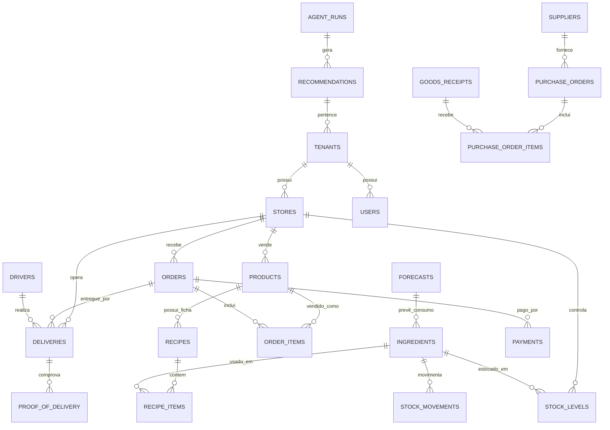
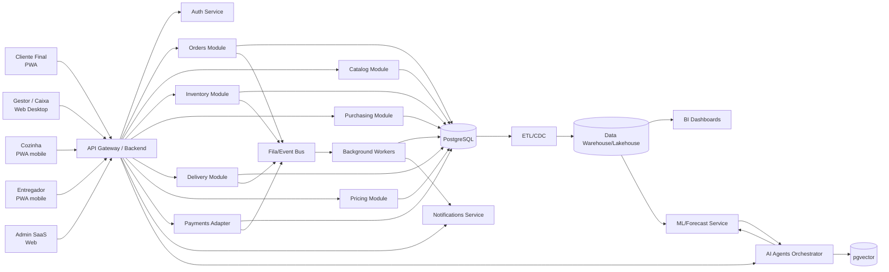
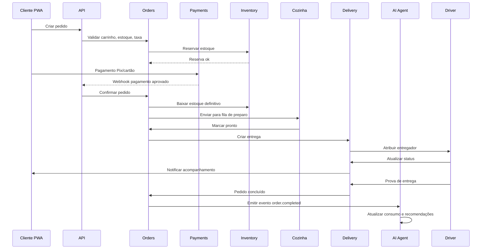
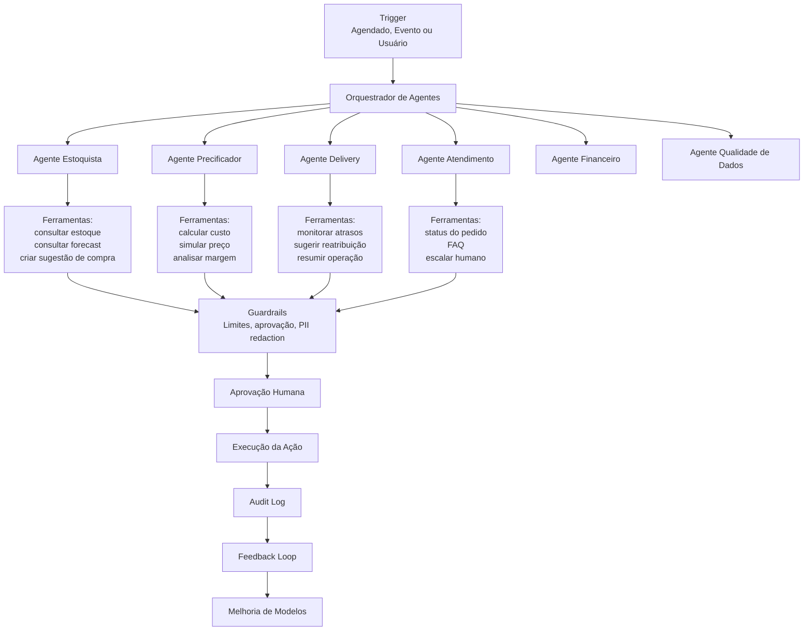

Perfeito. Vou seguir com o **pacote completo de desenvolvimento**, transformando o plano anterior em artefatos acionáveis para execução.

Abaixo você terá:

1. **PRD — Documento de Requisitos do Produto**
2. **Backlog Ágil formatado para Jira/Linear/Trello**
3. **Modelo de dados detalhado**
4. **Arquitetura técnica com diagramas**
5. **Estimativa de horas e plano de sprints**
6. **Pitch para investidor**
7. **Plano comercial e precificação SaaS**
8. **Próximos passos imediatos para os primeiros 14 dias**

Nome do projeto: **StockChef**.

---

# 1. PRD — Documento de Requisitos do Produto

## 1.1 Informações gerais

**Produto:** StockChef
**Tipo:** SaaS multi-tenant para delivery próprio, gestão de estoque, compras, precificação e agentes de IA
**Público inicial:** fast-foods, hamburguerias, pizzarias, marmitarias, cafeterias, dark kitchens e pequenos restaurantes com entrega própria
**Plataformas:** desktop web, PWA responsivo para operação/cozinha/gerente/entregador e PWA para cliente final
**Versão do documento:** 0.1
**Fase:** descoberta + MVP
**Objetivo principal do MVP:** permitir que um restaurante opere pedidos, entrega própria, estoque por ficha técnica, sugestão de compra e análise de margem com apoio de IA explicável.

---

## 1.2 Problema

Pequenos negócios de alimentação que operam delivery próprio geralmente sofrem com:

- falta de controle real de estoque de matéria-prima;
- compras feitas por intuição;
- ruptura de insumos críticos;
- desperdício por validade, erro de preparo ou excesso de compra;
- preço de venda definido sem análise de custo real e margem;
- operação de entrega desorganizada;
- ausência de indicadores confiáveis de lucro por prato;
- excesso de tarefas manuais administrativas.

Marketplaces ajudam na aquisição de clientes, mas não resolvem profundidade de gestão operacional, margem, estoque e entrega própria.

---

## 1.3 Proposta de valor

O StockChef será um sistema que:

- recebe pedidos pelo canal próprio;
- organiza a cozinha e a entrega;
- dá baixa automática no estoque por ficha técnica;
- sugere compras com base em consumo previsto, validade, lead time e estoque mínimo;
- calcula custo real e margem de cada prato;
- sugere preço de venda com análise de custo, concorrência e elasticidade;
- usa agentes de IA para monitorar operação, alertar riscos e automatizar tarefas administrativas com supervisão humana.

**Promessa central:**

> “Menos ruptura, menos desperdício, mais margem e menos trabalho manual para o seu delivery próprio.”

---

## 1.4 Objetivos do produto

### Objetivo de negócio

Criar um SaaS recorrente com alto valor percebido para restaurantes que querem controlar melhor sua operação e margem.

### Objetivos do MVP

1. Permitir operação completa de pedido e entrega própria.
2. Garantir baixa automática de estoque por venda.
3. Fornecer sugestão de compra confiável, ainda que baseada em regras simples.
4. Mostrar margem por prato com custo real.
5. Introduzir agente de IA assistivo para perguntas e resumos operacionais.
6. Validar retenção e disposição de pagamento com pilotos reais.

### Objetivos de longo prazo

1. Tornar-se sistema central de gestão de delivery próprio.
2. Criar inteligência proprietária de demanda, preço e supply chain alimentar.
3. Oferecer agentes de IA especializados para compras, atendimento, financeiro e operação.
4. Expandir para franquias, múltiplas unidades e integrações com fornecedores.

---

## 1.5 Hipóteses a validar

| Hipótese | Como validar | Métrica de sucesso |
|---|---|---|
| Restaurantes aceitarão cadastrar fichas técnicas | Onboarding assistido com pilotos | 80% dos pratos com ficha técnica em 14 dias |
| Baixa automática aumenta confiança no estoque | Comparar inventário antes/depois | Acuracidade acima de 90% |
| Sugestão de compra reduz ruptura | Medir faltas de insumos críticos | Redução de 10% a 25% |
| Gestão de margem por prato gera valor percebido | Entrevistas e retenção | 60% dos gestores usam relatório semanalmente |
| Agente de IA aumenta engajamento | Medir uso de perguntas/resumos | 30% dos tenants ativos usando IA semanalmente |
| Cliente paga por inteligência, não só por pedidos | Teste de planos | Conversão para plano pago acima de 20% no piloto |

---

## 1.6 Personas

### Persona 1 — Dono/Gerente

- Quer lucro, previsibilidade e controle.
- Não tem tempo para planilhas complexas.
- Precisa de respostas práticas: comprar o quê, cobrar quanto, onde está perdendo dinheiro.

### Persona 2 — Cozinheiro/Chefe

- Precisa saber o que está acabando e o que preparar.
- Usa tablet/celular na cozinha.
- Quer evitar interrupção por falta de insumo.

### Persona 3 — Comprador/Estoquista

- Precisa de lista de compras objetiva.
- Quer registrar recebimento, perda e inventário.
- Precisa comparar fornecedores e preços.

### Persona 4 — Entregador

- Precisa receber pedidos, endereço, contato e confirmação de entrega.
- Quer app simples, com bom uso de bateria e funcionamento offline básico.

### Persona 5 — Cliente final

- Quer pedir facilmente, acompanhar entrega e pagar online.
- Prefere experiência rápida via link/QR code/PWA.

### Persona 6 — Admin do SaaS

- Gerencia clientes, planos, suporte, uso de IA, billing e saúde da plataforma.

---

## 1.7 Escopo do MVP

### Dentro do escopo

- Autenticação e multiempresa.
- Cadastro de loja, usuários e papéis.
- Cadastro de insumos, unidades, conversões e fornecedores.
- Cadastro de produtos e fichas técnicas.
- Cardápio digital via PWA.
- Pedidos com status e histórico.
- Checkout com Pix e cartão.
- Painel de pedidos para desktop e mobile.
- Delivery próprio básico.
- PWA do entregador.
- Prova de entrega.
- Estoque com entrada, saída, ajuste, perda e inventário.
- Baixa automática por pedido.
- Alerta de estoque mínimo e validade.
- Sugestão de compra por regras.
- Pedido de compra simples.
- Dashboard de vendas, margem e rupturas.
- Agente de IA inicial para resumo diário e perguntas sobre dados.
- Logs de auditoria.
- Backup básico.
- LGPD operacional mínima.

### Fora do escopo do MVP

- App nativo do cliente final.
- App nativo do entregador com recursos avançados.
- Roteirização otimizada multi-parada.
- Múltiplas unidades complexas.
- Integração com iFood/Rappi.
- Emissão fiscal completa.
- ERP contador.
- Automação total de compras e preços sem aprovação humana.
- White-label.
- Marketplace de fornecedores.
- Programa de fidelidade avançado.
- Marketing automation.

---

## 1.8 Requisitos funcionais

### RF01 — Autenticação e multi-tenancy

- O sistema deve permitir criação de conta, login, recuperação de senha e MFA opcional.
- Cada usuário deve pertencer a um tenant.
- Um tenant pode ter uma ou mais lojas.
- Papéis mínimos: owner, manager, cashier, kitchen, buyer, driver, support.
- Todas as consultas devem ser isoladas por tenant.

### RF02 — Cadastros básicos

O sistema deve permitir cadastrar:

- loja/unidade;
- usuários;
- categorias de produto;
- produtos;
- adicionais/variações;
- insumos;
- unidades de medida;
- conversões entre unidades;
- fornecedores;
- zonas de entrega;
- taxas de entrega;
- formas de pagamento.

### RF03 — Ficha técnica

- Cada produto deve poder possuir uma ficha técnica.
- A ficha técnica deve listar insumos e quantidades.
- O sistema deve calcular custo do produto com base nos insumos.
- Deve permitir versão histórica da ficha técnica.
- Deve alertar produto sem ficha técnica cadastrada.

### RF04 — Cardápio digital

- O cliente deve acessar cardápio via link/QR code/PWA.
- Deve poder navegar por categorias, ver detalhes, adicionar itens ao carrinho.
- Deve poder escolher adicionais, observações, endereço e horário.
- Deve ver taxa de entrega e total.
- Deve receber confirmação do pedido.

### RF05 — Pedidos

- O sistema deve criar pedido com status:
  - recebido;
  - confirmado;
  - em preparo;
  - pronto;
  - saiu para entrega;
  - entregue;
  - cancelado;
  - reembolso.
- Deve registrar histórico de eventos.
- Deve permitir cancelamento com motivo.
- Deve bloquear ou alertar venda sem estoque suficiente, conforme configuração.
- Deve imprimir ou enviar para fila de cozinha.

### RF06 — Pagamentos

- Integração com PSP para Pix e cartão.
- Suporte a pagamento na entrega, se habilitado.
- Registro de transação, status, comprovante e conciliação simples.
- Não armazenar dados sensíveis de cartão diretamente.

### RF07 — Delivery próprio

- Deve permitir cadastrar entregadores.
- Deve atribuir pedido a entregador manual ou automaticamente.
- Deve atualizar status da entrega.
- Deve registrar ETA básico.
- Deve permitir prova de entrega: foto, assinatura ou código.
- Deve registrar ocorrências.
- Deve calcular taxa por zona/distância/horário.

### RF08 — Estoque

- Deve movimentar estoque por:
  - compra;
  - venda;
  - perda;
  - ajuste;
  - inventário;
  - devolução, em fase futura.
- Deve controlar validade e lote.
- Deve aplicar FEFO como padrão sugerido.
- Deve calcular custo médio ponderado móvel.
- Deve alertar estoque mínimo, validade próxima e divergência.

### RF09 — Compras

- Deve gerar sugestão de compra com base em:
  - estoque atual;
  - consumo médio;
  - previsão simples de demanda;
  - lead time do fornecedor;
  - estoque mínimo;
  - estoque máximo;
  - quantidade mínima de compra.
- Deve permitir transformar sugestão em pedido de compra.
- Deve registrar recebimento parcial ou total.
- Deve manter histórico de preço por fornecedor.

### RF10 — Precificação

- Deve calcular custo variável do prato.
- Deve considerar margem alvo configurável.
- Deve sugerir faixa de preço.
- Deve simular impacto de mudança de preço em margem.
- Deve permitir aplicar novo preço somente com aprovação humana.

### RF11 — Analytics

Dashboards mínimos:

- vendas por período;
- ticket médio;
- produtos mais vendidos;
- margem por produto;
- produtos com margem negativa;
- estoque crítico;
- perdas por motivo;
- tempo médio de entrega;
- atrasos;
- rupturas;
- adoção de sugestões de compra.

### RF12 — Agente de IA inicial

O MVP deve incluir um assistente capaz de:

- responder perguntas sobre dados do tenant;
- gerar resumo diário;
- listar itens com risco de falta;
- explicar sugestões de compra;
- apontar pratos com margem baixa;
- sugerir ações, sem executar automaticamente ações críticas.

Exemplos de perguntas:

- “O que preciso comprar para amanhã?”
- “Quais pratos estão com margem abaixo de 40%?”
- “Quais insumos vencem em 3 dias?”
- “Qual foi minha venda de ontem comparada à média da semana?”

### RF13 — Administração SaaS

- Gestão de planos e assinaturas.
- Limites de uso por plano.
- Métricas de adoção.
- Suporte e logs.
- Feature flags.
- Impersonação segura para suporte, com auditoria.

---

## 1.9 Requisitos não funcionais

### Desempenho

- Painel de pedidos deve atualizar em tempo real ou near real-time.
- Checkout deve responder em menos de 2 segundos em condições normais.
- Sistema deve suportar pico de pedidos sem perda de dados.

### Disponibilidade

- Meta inicial: 99,5% uptime.
- Degradação graciosa se IA, mapa ou pagamento indisponível.

### Segurança

- Criptografia em trânsito e repouso.
- Controle de acesso por papel.
- MFA para administradores.
- Logs de auditoria.
- Proteção contra SQL injection, XSS, CSRF, prompt injection e abuso de APIs.
- Segregação de dados por tenant.

### LGPD/Privacidade

- Coleta mínima necessária.
- Base legal clara.
- Direitos do titular: acesso, correção, exclusão, portabilidade.
- Política de retenção.
- Anonimização para analytics agregados.
- Contrato de operador com fornecedores de nuvem, IA e pagamento.

### Escalabilidade

- Arquitetura preparada para crescimento de tenants, pedidos e eventos.
- Filas para processamento assíncrono.
- Cache para leituras quentes.
- Observabilidade completa.

### Usabilidade

- Interface simples para operação em cozinha.
- Botões grandes no mobile.
- Funcionamento offline básico para entregador e inventário.
- Onboarding guiado.

---

## 1.10 Métricas de sucesso do MVP

| Métrica | Meta inicial |
|---|---:|
| Tenants ativos no piloto | 10 a 30 |
| Pedidos processados/mês no piloto | 5.000+ |
| Acuracidade de estoque | > 90% |
| Pratos com ficha técnica | > 80% |
| Redução de ruptura em insumos críticos | 10% a 25% |
| Adoção de sugestão de compra | > 50% |
| Uso semanal de dashboard de margem | > 60% dos gestores |
| Uso semanal de IA | > 30% dos tenants |
| NPS do piloto | > 40 |
| Incidentes críticos/mês | < 1 |
| Churn mensal no piloto | < 5% |

---

## 1.11 Riscos principais

| Risco | Probabilidade | Impacto | Mitigação |
|---|---|---|---|
| Cliente não cadastra ficha técnica | Alta | Alto | Onboarding assistido, importação CSV, agente de qualidade de dados |
| Estoque impreciso | Alta | Alto | Inventário cíclico, alertas, auditoria, integração futura com balança/PDV |
| IA recomenda errado | Média | Alto | Human-in-the-loop, explicações, limites, backtesting |
| Complexidade de pagamento | Média | Alto | Usar PSP maduro, começar simples |
| Delivery próprio gera passivo trabalhista | Média | Alto | Orientação jurídica, termos claros, seguro, modelo de parceria |
| Escopo inflado | Alta | Alto | MVP rigoroso, backlog priorizado, fases claras |
| Baixa retenção | Média | Alto | Foco em resultado financeiro: margem, ruptura, desperdício |

---

# 2. Backlog Ágil para Jira/Linear

Formato sugerido:

- **Épico**
- **História**
- **Critérios de aceite**
- **Prioridade**
- **Pontos de história**

Escala de pontos: 1, 2, 3, 5, 8, 13.
Prioridade: MoSCoW — Must, Should, Could, Won’t.

---

## Épico E01 — Fundação e Multi-tenancy

| ID | História | Critérios de aceite | Prioridade | Pontos |
|---|---|---|---|---:|
| US001 | Como visitante, quero criar minha conta para acessar o sistema | Cadastro com e-mail, senha, nome da empresa; validação; envio de verificação | Must | 3 |
| US002 | Como usuário, quero fazer login com segurança | Login, logout, recuperação de senha, sessão segura, bloqueio após tentativas | Must | 3 |
| US003 | Como owner, quero criar minha loja | Nome, endereço, horário, telefone, logo, status | Must | 3 |
| US004 | Como owner, quero convidar usuários e definir papéis | Convite por e-mail, papéis, revogação, pendências | Must | 5 |
| US005 | Como sistema, devo isolar dados por tenant | Nenhuma consulta retorna dado de outro tenant; testes automatizados | Must | 5 |
| US006 | Como admin SaaS, quero visualizar tenants e status | Lista, filtros, uso básico, suspensão/reativação | Should | 3 |

---

## Épico E02 — Cadastros Operacionais

| ID | História | Critérios de aceite | Prioridade | Pontos |
|---|---|---|---|---:|
| US007 | Como comprador, quero cadastrar insumos | Nome, unidade, categoria, custo, fornecedor padrão, estoque mínimo, validade | Must | 3 |
| US008 | Como comprador, quero cadastrar unidades e conversões | kg, g, L, ml, un, pacote; conversões válidas | Must | 5 |
| US009 | Como comprador, quero cadastrar fornecedores | Nome, contato, CNPJ/CPF opcional, lead time, condição mínima | Must | 3 |
| US010 | Como gerente, quero importar cadastros via CSV | Template, validação, erros linha a linha | Should | 5 |
| US011 | Como sistema, devo impedir insumo sem unidade válida | Validação no cadastro e edição | Must | 2 |

---

## Épico E03 — Produtos e Ficha Técnica

| ID | História | Critérios de aceite | Prioridade | Pontos |
|---|---|---|---|---:|
| US012 | Como gerente, quero cadastrar produtos | Nome, categoria, preço, descrição, foto, disponibilidade | Must | 3 |
| US013 | Como gerente, quero criar adicionais e variações | Adicional cobrado/não cobrado, obrigatório/opcional, grupo | Should | 5 |
| US014 | Como chef, quero montar ficha técnica do produto | Selecionar insumos, quantidades, unidades, salvar versão | Must | 8 |
| US015 | Como sistema, devo calcular custo do produto pela ficha técnica | Custo soma insumos × quantidade × custo unitário | Must | 5 |
| US016 | Como gerente, quero ver produto sem ficha técnica | Alerta no dashboard e no cadastro | Must | 2 |
| US017 | Como sistema, devo manter histórico de versões da ficha técnica | Data, usuário, alterações, restauração futura | Could | 5 |

---

## Épico E04 — Cardápio Digital e Checkout

| ID | História | Critérios de aceite | Prioridade | Pontos |
|---|---|---|---|---:|
| US018 | Como cliente, quero acessar cardápio via link/QR code | Página responsiva, carregar rápido, sem login obrigatório | Must | 5 |
| US019 | Como cliente, quero navegar por categorias e produtos | Filtros, busca, fotos, descrição, preço | Must | 3 |
| US020 | Como cliente, quero adicionar itens ao carrinho | Quantidade, adicionais, observação, remover, editar | Must | 5 |
| US021 | Como cliente, quero informar endereço e escolher horário | CEP, mapa opcional, retirada/delivery, agendamento | Must | 8 |
| US022 | Como cliente, quero ver taxa de entrega calculada | Por zona, distância, horário, valor mínimo | Must | 5 |
| US023 | Como cliente, quero pagar com Pix/cartão | Integração PSP, retorno de status, confirmação | Must | 13 |
| US024 | Como cliente, quero receber confirmação do pedido | E-mail/WhatsApp/push opcional, número do pedido | Should | 3 |

---

## Épico E05 — Pedidos e Cozinha

| ID | História | Critérios de aceite | Prioridade | Pontos |
|---|---|---|---|---:|
| US025 | Como caixa, quero ver pedidos recebidos em tempo real | Lista, filtros, som/notificação, atualização automática | Must | 8 |
| US026 | Como cozinha, quero ver fila de preparo | Itens, quantidades, observações, tempo, status | Must | 8 |
| US027 | Como usuário, quero mudar status do pedido | Recebido → confirmado → preparo → pronto → entrega → concluído | Must | 5 |
| US028 | Como sistema, devo registrar eventos do pedido | Timestamp, usuário, status anterior/novo, motivo | Must | 3 |
| US029 | Como gerente, quero cancelar pedido com motivo | Motivo obrigatório, reembolso se aplicável, baixa reversa | Must | 5 |
| US030 | Como caixa, quero imprimir comanda | Template configurável, impressora térmica ou PDF | Should | 5 |

---

## Épico E06 — Delivery Próprio

| ID | História | Critérios de aceite | Prioridade | Pontos |
|---|---|---|---|---:|
| US031 | Como gestor, quero cadastrar entregador | Nome, telefone, veículo, documentos, status, taxa/ganho | Must | 3 |
| US032 | Como despachante, quero atribuir pedido a entregador | Lista de entregadores disponíveis, atribuição manual | Must | 5 |
| US033 | Como entregador, quero receber pedidos atribuídos | PWA, notificação, detalhes do pedido | Must | 8 |
| US034 | Como entregador, quero atualizar status da entrega | Saiu, em rota, entregue, ocorrência | Must | 5 |
| US035 | Como cliente, quero acompanhar status da entrega | Link de acompanhamento, ETA básico | Should | 5 |
| US036 | Como sistema, devo exigir prova de entrega | Foto, assinatura ou código PIN | Must | 5 |
| US037 | Como gestor, quero registrar ocorrência de entrega | Endereço errado, cliente não atende, atraso, avaria | Should | 3 |
| US038 | Como gestor, quero ver desempenho por entregador | Entregas, tempo médio, atrasos, avaliações | Could | 5 |

---

## Épico E07 — Estoque

| ID | História | Critérios de aceite | Prioridade | Pontos |
|---|---|---|---|---:|
| US039 | Como sistema, devo dar baixa automática de insumos ao confirmar pedido | Quantidade correta, idempotência, reversão em cancelamento | Must | 13 |
| US040 | Como estoquista, quero registrar entrada de compra | Fornecedor, itens, quantidades, custos, lote, validade | Must | 8 |
| US041 | Como estoquista, quero registrar perda | Insumo, quantidade, motivo, custo, usuário | Must | 5 |
| US042 | Como estoquista, quero ajustar inventário | Motivo obrigatório, valor antes/depois, auditoria | Must | 5 |
| US043 | Como gerente, quero fazer contagem mobile | Lista de insumos, digitação rápida, salvar offline básico | Should | 8 |
| US044 | Como sistema, devo alertar estoque mínimo | Notificação no painel e mobile | Must | 3 |
| US045 | Como sistema, devo alertar validade próxima | Regras configuráveis: 3, 7, 15 dias | Must | 5 |
| US046 | Como sistema, devo calcular custo médio ponderado móvel | Atualização em entrada, correção em ajuste | Must | 8 |

---

## Épico E08 — Compras

| ID | História | Critérios de aceite | Prioridade | Pontos |
|---|---|---|---|---:|
| US047 | Como comprador, quero ver sugestão de compra | Lista com insumo, quantidade sugerida, motivo, fornecedor | Must | 13 |
| US048 | Como comprador, quero transformar sugestão em pedido de compra | Rascunho, edição, aprovação | Must | 5 |
| US049 | Como gestor, quero aprovar compra acima de limite | Valor limite, aprovação obrigatória | Should | 5 |
| US050 | Como estoquista, quero registrar recebimento de pedido de compra | Parcial/total, divergência, custo real | Must | 8 |
| US051 | Como comprador, quero ver histórico de preço por fornecedor | Gráfico simples, variação, última compra | Could | 5 |

---

## Épico E09 — Precificação

| ID | História | Critérios de aceite | Prioridade | Pontos |
|---|---|---|---|---:|
| US052 | Como gestor, quero ver custo real do prato | Insumos, embalagem, taxa de pagamento opcional, perda média | Must | 8 |
| US053 | Como gestor, quero definir margem alvo por produto/categoria | Configuração salva e aplicada | Must | 3 |
| US054 | Como sistema, devo sugerir faixa de preço | Custo + margem alvo + arredondamento psicológico | Must | 5 |
| US055 | Como gestor, quero simular impacto de novo preço | Margem antiga/nova, volume estimado, receita estimada | Should | 8 |
| US056 | Como gestor, quero aplicar preço sugerido com aprovação | Mudança registrada, histórico, notificação | Must | 3 |

---

## Épico E10 — Analytics

| ID | História | Critérios de aceite | Prioridade | Pontos |
|---|---|---|---|---:|
| US057 | Como dono, quero dashboard de vendas | Período, canal, produto, categoria, ticket médio | Must | 8 |
| US058 | Como dono, quero dashboard de margem por prato | Receita, CMV, margem absoluta e percentual | Must | 8 |
| US059 | Como gestor, quero ver rupturas e perdas | Insumos faltantes, motivos, impacto estimado | Must | 5 |
| US060 | Como gestor, quero ver desempenho de delivery | Tempo médio, atrasos, entregador, zona | Should | 5 |
| US061 | Como admin SaaS, quero métricas de uso por tenant | Logins, pedidos, IA, estoque, features | Should | 5 |

---

## Épico E11 — Agente de IA

| ID | História | Critérios de aceite | Prioridade | Pontos |
|---|---|---|---|---:|
| US062 | Como gestor, quero perguntar sobre meus dados em linguagem natural | Resposta baseada apenas no tenant, com fonte | Must | 13 |
| US063 | Como gestor, quero resumo diário por e-mail/WhatsApp | Vendas, alertas, estoque crítico, sugestões | Should | 8 |
| US064 | Como sistema, agente estoquista deve gerar sugestão de compra explicada | Motivo, dados usados, confiança, ação aprovável | Must | 13 |
| US065 | Como gestor, quero aprovar/rejeitar recomendação da IA | Feedback salvo para melhoria | Must | 5 |
| US066 | Como admin, quero auditar ações do agente | Prompt, ferramentas, resposta, usuário, timestamp | Must | 8 |
| US067 | Como sistema, devo impedir ação crítica da IA sem aprovação | Compra, preço, reembolso, comunicação em massa | Must | 5 |

---

## Épico E12 — Billing e Administração SaaS

| ID | História | Critérios de aceite | Prioridade | Pontos |
|---|---|---|---|---:|
| US068 | Como owner, quero assinar um plano | Checkout, trial, upgrade/downgrade | Should | 8 |
| US069 | Como sistema, devo aplicar limites por plano | Usuários, lojas, pedidos, IA, storage | Should | 5 |
| US070 | Como admin SaaS, quero suspender conta por inadimplência | Aviso, suspensão, reativação | Should | 3 |
| US071 | Como owner, quero baixar notas fiscais da assinatura | Integração futura ou manual no MVP | Could | 3 |

---

# 3. Modelo de Dados Detalhado

## 3.1 Princípios

- Multi-tenant lógico com `tenant_id` em todas as tabelas de negócio.
- Soft delete quando necessário.
- Auditoria em tabelas críticas.
- Eventos para rastreabilidade.
- Idempotência para operações financeiras e de estoque.
- Separação entre dados transacionais e analíticos.

---

## 3.2 Diagrama conceitual simplificado



---

## 3.3 Tabelas principais

### tenants

| Campo | Tipo | Observação |
|---|---|---|
| id | uuid | PK |
| name | string | Nome da empresa |
| slug | string | Identificador amigável |
| status | enum | active, suspended, canceled |
| plan_id | uuid | FK plans |
| created_at | timestamp |  |
| updated_at | timestamp |  |

---

### stores

| Campo | Tipo | Observação |
|---|---|---|
| id | uuid | PK |
| tenant_id | uuid | FK tenants |
| name | string |  |
| address | jsonb | Endereço estruturado |
| phone | string |  |
| opening_hours | jsonb |  |
| delivery_enabled | boolean |  |
| pickup_enabled | boolean |  |
| status | enum | active, inactive |

---

### users

| Campo | Tipo | Observação |
|---|---|---|
| id | uuid | PK |
| tenant_id | uuid | FK |
| email | string | único por tenant ou global |
| password_hash | string |  |
| name | string |  |
| phone | string |  |
| status | enum | active, invited, disabled |
| mfa_enabled | boolean |  |

---

### roles / permissions

Pode ser modelo RBAC simples:

- roles: id, tenant_id, name, description.
- user_roles: user_id, role_id.
- permissions: id, code, description.
- role_permissions: role_id, permission_id.

Papéis sugeridos:

- owner
- manager
- cashier
- kitchen
- buyer
- driver
- support
- admin_saas

---

### suppliers

| Campo | Tipo |
|---|---|
| id | uuid |
| tenant_id | uuid |
| name | string |
| document | string |
| contact_name | string |
| email | string |
| phone | string |
| lead_time_days | integer |
| minimum_order_value | decimal |
| status | enum |

---

### units

| Campo | Tipo |
|---|---|
| id | uuid |
| tenant_id | uuid |
| name | string |
| symbol | string |
| type | enum: mass, volume, count, length |

---

### unit_conversions

| Campo | Tipo |
|---|---|
| id | uuid |
| tenant_id | uuid |
| from_unit_id | uuid |
| to_unit_id | uuid |
| factor | decimal |
| comment | string |

Exemplo: 1 caixa = 24 unidades; 1 pacote = 500 g.

---

### ingredients

| Campo | Tipo |
|---|---|
| id | uuid |
| tenant_id | uuid |
| store_id | uuid nullable se estoque global |
| name | string |
| category | string |
| base_unit_id | uuid |
| default_supplier_id | uuid |
| average_cost | decimal |
| minimum_stock | decimal |
| maximum_stock | decimal |
| shelf_life_days | integer |
| waste_factor | decimal |
| status | enum |

---

### stock_levels

| Campo | Tipo |
|---|---|
| id | uuid |
| tenant_id | uuid |
| store_id | uuid |
| ingredient_id | uuid |
| quantity | decimal |
| average_cost | decimal |
| last_counted_at | timestamp |
| updated_at | timestamp |

Índice único: `(store_id, ingredient_id)`.

---

### stock_movements

| Campo | Tipo |
|---|---|
| id | uuid |
| tenant_id | uuid |
| store_id | uuid |
| ingredient_id | uuid |
| type | enum: purchase, sale, loss, adjustment, transfer, return |
| quantity | decimal |
| unit_cost | decimal |
| reference_type | string |
| reference_id | uuid |
| reason | string |
| user_id | uuid |
| created_at | timestamp |

Importante: operation idempotency key para evitar baixa duplicada.

---

### products

| Campo | Tipo |
|---|---|
| id | uuid |
| tenant_id | uuid |
| store_id | uuid |
| category_id | uuid |
| name | string |
| description | text |
| price | decimal |
| image_url | string |
| active | boolean |
| stock_control_enabled | boolean |
| preparation_time_minutes | integer |

---

### product_modifiers

| Campo | Tipo |
|---|---|
| id | uuid |
| tenant_id | uuid |
| product_id | uuid |
| group_name | string |
| modifier_name | string |
| price_delta | decimal |
| required | boolean |
| min_selection | integer |
| max_selection | integer |

---

### recipes

| Campo | Tipo |
|---|---|
| id | uuid |
| tenant_id | uuid |
| product_id | uuid |
| version | integer |
| status | enum: draft, active, archived |
| effective_from | timestamp |
| created_by | uuid |

---

### recipe_items

| Campo | Tipo |
|---|---|
| id | uuid |
| recipe_id | uuid |
| ingredient_id | uuid |
| quantity | decimal |
| unit_id | uuid |
| waste_factor | decimal |
| optional | boolean |

---

### zones

| Campo | Tipo |
|---|---|
| id | uuid |
| tenant_id | uuid |
| store_id | uuid |
| name | string |
| geometry | jsonb |
| cep_ranges | jsonb |
| delivery_fee | decimal |
| min_order_value | decimal |
| eta_minutes | integer |

---

### delivery_fees

Pode ser tabela de regras:

| Campo | Tipo |
|---|---|
| id | uuid |
| zone_id | uuid |
| rule_type | enum: flat, distance, time, weight |
| min_value | decimal |
| max_value | decimal |
| fee | decimal |

---

### drivers

| Campo | Tipo |
|---|---|
| id | uuid |
| tenant_id | uuid |
| name | string |
| phone | string |
| document | string |
| vehicle_type | enum |
| plate | string |
| payment_model | enum: per_delivery, hourly, monthly |
| status | enum |
| rating_average | decimal |

---

### orders

| Campo | Tipo |
|---|---|
| id | uuid |
| tenant_id | uuid |
| store_id | uuid |
| code | string |
| customer_id | uuid nullable |
| status | enum |
| channel | enum: own_pwa, whatsapp, phone, pos, marketplace_future |
| fulfillment_type | enum: delivery, pickup, table |
| subtotal | decimal |
| delivery_fee | decimal |
| discount_total | decimal |
| tax_total | decimal |
| total | decimal |
| expected_time | timestamp |
| notes | text |
| created_at | timestamp |
| updated_at | timestamp |

---

### order_items

| Campo | Tipo |
|---|---|
| id | uuid |
| order_id | uuid |
| product_id | uuid |
| quantity | integer |
| unit_price | decimal |
| total_price | decimal |
| modifiers | jsonb |
| notes | text |
| recipe_snapshot | jsonb |

Importante: guardar snapshot da ficha técnica no momento do pedido para evitar problema se receita mudar.

---

### order_events

| Campo | Tipo |
|---|---|
| id | uuid |
| order_id | uuid |
| event_type | string |
| from_status | string |
| to_status | string |
| user_id | uuid |
| payload | jsonb |
| created_at | timestamp |

---

### payments

| Campo | Tipo |
|---|---|
| id | uuid |
| tenant_id | uuid |
| order_id | uuid |
| provider | string |
| provider_payment_id | string |
| method | enum: pix, credit_card, debit_card, cash, voucher |
| amount | decimal |
| status | enum: pending, authorized, captured, failed, refunded |
| idempotency_key | string |
| raw_response | jsonb |
| created_at | timestamp |

---

### deliveries

| Campo | Tipo |
|---|---|
| id | uuid |
| tenant_id | uuid |
| order_id | uuid |
| driver_id | uuid nullable |
| status | enum: pending, assigned, picked_up, in_transit, delivered, failed, canceled |
| assigned_at | timestamp |
| picked_up_at | timestamp |
| delivered_at | timestamp |
| eta_minutes | integer |
| route_hint | jsonb |
| occurrence | text |

---

### proof_of_delivery

| Campo | Tipo |
|---|---|
| id | uuid |
| delivery_id | uuid |
| type | enum: photo, signature, pin, customer_confirmation |
| file_url | string |
| received_by | string |
| created_at | timestamp |

---

### purchase_orders

| Campo | Tipo |
|---|---|
| id | uuid |
| tenant_id | uuid |
| store_id | uuid |
| supplier_id | uuid |
| status | enum: draft, sent, partially_received, received, canceled |
| expected_date | date |
| total_amount | decimal |
| created_by | uuid |
| approved_by | uuid nullable |

---

### purchase_order_items

| Campo | Tipo |
|---|---|
| id | uuid |
| purchase_order_id | uuid |
| ingredient_id | uuid |
| quantity | decimal |
| unit_id | uuid |
| unit_cost | decimal |
| received_quantity | decimal |

---

### goods_receipts

| Campo | Tipo |
|---|---|
| id | uuid |
| purchase_order_id | uuid nullable |
| supplier_id | uuid |
| received_at | timestamp |
| received_by | uuid |
| invoice_number | string |
| notes | text |

---

### losses

| Campo | Tipo |
|---|---|
| id | uuid |
| tenant_id | uuid |
| store_id | uuid |
| ingredient_id | uuid |
| quantity | decimal |
| cost | decimal |
| reason | enum: expiration, cooking_error, damage, theft, return, other |
| occurred_at | timestamp |
| registered_by | uuid |

---

### inventory_counts

| Campo | Tipo |
|---|---|
| id | uuid |
| tenant_id | uuid |
| store_id | uuid |
| status | enum: open, closed |
| started_by | uuid |
| started_at | timestamp |
| closed_at | timestamp |

---

### inventory_count_items

| Campo | Tipo |
|---|---|
| id | uuid |
| inventory_count_id | uuid |
| ingredient_id | uuid |
| system_quantity | decimal |
| counted_quantity | decimal |
| difference | decimal |
| adjusted | boolean |

---

### forecasts

| Campo | Tipo |
|---|---|
| id | uuid |
| tenant_id | uuid |
| store_id | uuid |
| entity_type | enum: product, ingredient |
| entity_id | uuid |
| horizon_date | date |
| predicted_quantity | decimal |
| confidence_interval_low | decimal |
| confidence_interval_high | decimal |
| model_version | string |
| created_at | timestamp |

---

### recommendations

| Campo | Tipo |
|---|---|
| id | uuid |
| tenant_id | uuid |
| store_id | uuid |
| type | enum: purchase, pricing, waste, delivery, menu |
| entity_id | uuid |
| title | string |
| message | text |
| explanation | jsonb |
| suggested_action | jsonb |
| status | enum: pending, accepted, rejected, expired, executed |
| confidence | decimal |
| created_by_agent_run_id | uuid |
| created_at | timestamp |

---

### agent_runs

| Campo | Tipo |
|---|---|
| id | uuid |
| tenant_id | uuid |
| agent_type | enum: stock, pricing, delivery, support, finance, onboarding, data_quality |
| trigger | enum: schedule, user_prompt, event |
| input_summary | text |
| tools_used | jsonb |
| output_summary | text |
| status | enum: running, succeeded, failed, blocked |
| started_at | timestamp |
| finished_at | timestamp |

---

### audit_logs

| Campo | Tipo |
|---|---|
| id | uuid |
| tenant_id | uuid |
| user_id | uuid nullable |
| agent_run_id | uuid nullable |
| action | string |
| entity_type | string |
| entity_id | uuid |
| before | jsonb |
| after | jsonb |
| ip | string |
| created_at | timestamp |

---

### subscriptions / plans / usage_metrics

Tabelas para SaaS:

- plans
- subscriptions
- invoices
- usage_metrics
- feature_flags

---

## 3.4 Índices importantes

- `orders (tenant_id, store_id, created_at desc)`
- `order_events (order_id, created_at)`
- `stock_movements (tenant_id, store_id, ingredient_id, created_at desc)`
- `stock_levels (tenant_id, store_id, ingredient_id)` unique
- `recommendations (tenant_id, status, created_at desc)`
- `payments (provider_payment_id)` unique
- `purchase_orders (tenant_id, supplier_id, status)`
- `deliveries (tenant_id, status, assigned_at)`

---

## 3.5 Eventos de domínio sugeridos

```text
order.created
order.confirmed
order.cancelled
order.ready_for_delivery
payment.captured
payment.failed
stock.reserved
stock.decremented
stock.adjusted
stock.loss_registered
purchase.suggested
purchase_order.created
goods_receipt.created
delivery.assigned
delivery.in_transit
delivery.completed
price.changed
forecast.updated
ai.recommendation.generated
ai.action.approved
ai.action.rejected
tenant.subscription.changed
```

---

# 4. Arquitetura Técnica

## 4.1 Visão de alto nível



---

## 4.2 Recomendação de stack

### Frontend administrativo

- React + TypeScript
- Next.js ou Vite
- Tailwind CSS ou design system próprio
- Shadcn/UI
- TanStack Query
- Chart.js, Recharts ou Apache ECharts
- Conceitos IHC

### Mobile operação/cozinha/entregador

Opção recomendada:

- PWA responsivo
- TypeScript
- Offline-first com WatermelonDB e MMKV juntos. MMKV: para estado global rápido, tokens, configurações, tema (dark/light) e pequenos caches de sessão. WatermelonDB: para todos os dados estruturados.
- Push notifications com Firebase Cloud Messaging/APNs
- Conceitos IHC

### Cliente final

- PWA responsivo
- Next.js ou React SPA
- SEO básico se quiser captura orgânica
- QR code para acesso rápido

### Backend

Recomendação prática:

- **Python + FastAPI** para a API e serviços de dados/IA.
- Monólito modular no MVP, com Clean Architecture e Design Patterns para regras de negócio e integrações.

### Banco de dados

- PostgreSQL principal.
- Row-Level Security ou tenant_id disciplinado para multi-tenancy.
- Redis para cache, sessões, filas leves e rate limiting.
- TimescaleDB para séries temporais e analytics.
- pgvector para embeddings/RAG.
- MinIO ou UploadThing para arquivos.

### Filas/eventos

- RabbitMQ.

### Infraestrutura

- Containers Docker.
- GitHub Actions para CI/CD.

### IA

- LLM provedor: OpenAI, Anthropic, Google, Azure OpenAI ou open-source.
- Framework de agentes: LangGraph, LlamaIndex, CrewAI ou camada própria.
- ML tradicional: LightGBM, XGBoost, Prophet, scikit-learn.
- Orquestração de pipelines: Airflow, Dagster ou Prefect.
- MLOps: MLflow, DVC.

---

## 4.3 Estratégia multi-tenant

### MVP

- Banco compartilhado.
- Coluna `tenant_id` obrigatória.
- Row-Level Security no PostgreSQL.
- Middleware que injeta contexto do tenant.
- Testes automatizados para evitar vazamento entre tenants.

### Futuro enterprise

- Schema por tenant ou banco dedicado.
- Isolamento físico para clientes grandes.
- BYOK — bring your own key — se necessário.

---

## 4.4 Fluxo crítico: pedido → estoque → entrega



---

## 4.5 Arquitetura de agentes de IA



### Princípios dos agentes

- Todo agente tem papel limitado.
- Toda ação sensível exige aprovação humana.
- Toda resposta deve citar fontes internas.
- Todo run é auditável.
- Nenhum agente acessa dados de outro tenant.
- Dados pessoais sensíveis devem ser mascarados antes de ir para LLM externo.
- Se o LLM falhar, o sistema cai para regras determinísticas.

---

## 4.6 Segurança e LGPD na arquitetura

- HTTPS obrigatório.
- Tokens JWT curtos + refresh tokens rotativos.
- MFA para owner/admin.
- RBAC por tenant.
- Row-Level Security.
- Criptografia at-rest.
- Secrets manager.
- WAF/rate limiting.
- Logs estruturados sem dados sensíveis.
- PII redaction antes de chamadas externas de IA.
- Retenção configurável.
- Endpoint de exclusão/anonimização de dados pessoais.
- Backups criptografados e restore testado.
- Pentest periódico.
- Política de incidentes.

---

## 4.7 Observabilidade

Métricas mínimas:

- taxa de erro por endpoint;
- latência p50/p95/p99;
- pedidos criados/confirmados/cancelados;
- falhas de pagamento;
- falhas de webhook;
- atraso de fila;
- uso de IA por tenant;
- taxa de aceite de recomendações;
- divergência de estoque;
- uptime;
- custo por requisição LLM;
- número de ações de agente bloqueadas por guardrail.

---

# 5. Estimativa de Horas e Plano de Sprints

## 5.1 Premissas de equipe

Equipe mínima recomendada para MVP em ~6 meses:

- 1 Product Manager/Owner — 0,5 a 1 FTE
- 1 Tech Lead/Arquiteto — 0,5 a 1 FTE
- 2 Desenvolvedores Full-stack — 2 FTE
- 1 Desenvolvedor Mobile — 1 FTE
- 1 Engenheiro de Dados/ML — 0,5 a 1 FTE
- 1 Especialista IA/LLM — 0,5 FTE
- 1 DevOps/SRE — 0,3 a 0,5 FTE
- 1 QA — 0,5 FTE
- 1 UX/UI — 0,3 a 0,5 FTE

Total aproximado: **6 a 8 FTEs**, dependendo do ritmo.

---

## 5.2 Capacidade por sprint

Sprint de 2 semanas.

Considerando 6 pessoas alocadas em média e 20% de overhead:

- 6 pessoas × 80 horas = 480 horas brutas
- 20% overhead = 384 horas úteis por sprint

Em 12 sprints:

- 12 × 384 = **4.608 horas**

Para um time um pouco menor, considere faixa de **3.000 a 4.500 horas** para MVP comercial robusto.

---

## 5.3 Plano de sprints sugerido

| Sprint | Tema | Entregas principais | Horas estimadas |
|---:|---|---|---:|
| S01 | Descoberta e blueprint | Entrevistas, PRD, wireframes, modelo de dados inicial | 250–350 |
| S02 | Fundação | Auth, multi-tenant, usuários, papéis, loja | 300–400 |
| S03 | Cadastros | Insumos, unidades, fornecedores, produtos | 300–400 |
| S04 | Ficha técnica | Recipes, custo do produto, validações | 300–400 |
| S05 | PWA cliente | Cardápio, carrinho, endereço, taxa | 350–450 |
| S06 | Pedidos | Criação de pedido, painel, status, eventos | 350–450 |
| S07 | Pagamentos | Pix/cartão, webhook, conciliação básica | 350–500 |
| S08 | Cozinha/mobile | Fila de preparo, atualização de status | 300–400 |
| S09 | Delivery próprio | Entregador, atribuição, prova de entrega | 350–500 |
| S10 | Estoque | Baixa automática, perda, inventário, validade | 400–550 |
| S11 | Compras | Sugestão por regra, pedido de compra, recebimento | 350–500 |
| S12 | Analytics e IA inicial | Dashboards, margem, agente conversacional básico | 400–600 |
| S13+ | Piloto, billing, hardening | Correções, segurança, assinatura, onboarding | contínuo |

Total até S12: aproximadamente **4.200 a 5.950 horas**, dependendo da equipe e complexidade real.

Se quiser um MVP mais enxuto, é possível cortar algumas features e chegar em **2.500 a 3.500 horas**.

---

## 5.4 Estimativa por épico

| Épico | Pontos | Horas aproximadas | Observação |
|---|---:|---:|---|
| E01 Fundação | 22 | 120–180 | Base crítica |
| E02 Cadastros | 18 | 100–160 | Importação CSV pode ficar depois |
| E03 Produtos/Ficha | 28 | 160–240 | Coração do estoque |
| E04 Checkout | 42 | 250–380 | PWA + pagamento |
| E05 Pedidos/Cozinha | 34 | 200–320 | Tempo real e eventos |
| E06 Delivery | 42 | 260–400 | PWA entregador |
| E07 Estoque | 50 | 320–480 | Baixa automática complexa |
| E08 Compras | 34 | 220–360 | Sugestão por regra |
| E09 Precificação | 27 | 160–280 | MVP simples |
| E10 Analytics | 31 | 200–340 | Dashboards |
| E11 IA | 52 | 350–550 | Agente assistivo |
| E12 Billing | 19 | 120–220 | Pode ser manual no início |

Total grosseiro: **2.500 a 4.000 horas** de engenharia/produto/dados, sem contar vendas, jurídico, marketing e suporte pesado.

---

# 6. Pitch para Investidor

## 6.1 Elevator pitch

> O StockChef é um SaaS para restaurantes e pequenos negócios de alimentação que operam delivery próprio. Diferente de marketplaces e sistemas de PDV comuns, conectamos pedidos, estoque de matéria-prima, compras, precificação e agentes de IA em uma única plataforma. Nosso objetivo é reduzir ruptura, desperdício e preço mal formado, aumentando a margem do restaurante com inteligência operacional explicável.

---

## 6.2 Estrutura de pitch deck sugerida

### Slide 1 — Capa

**StockChef**
Delivery próprio, estoque inteligente e agentes de IA para restaurantes.

---

### Slide 2 — Problema

Restaurantes pequenos operam no escuro:

- não sabem o custo real de cada prato;
- compram por intuição;
- perdem estoque por validade e erro;
- têm delivery próprio desorganizado;
- pagam comissão alta em marketplace sem controle de margem.

Resultado:

- baixa previsibilidade;
- margem comprimida;
- desperdício;
- retrabalho administrativo.

---

### Slide 3 — Solução

Plataforma SaaS que une:

1. Cardápio digital e pedidos.
2. Delivery próprio com rastreabilidade.
3. Estoque por ficha técnica.
4. Sugestão de compra inteligente.
5. Precificação assistida.
6. Agentes de IA para gestão operacional.

---

### Slide 4 — Por que agora

- Delivery próprio cresceu como alternativa à dependência de marketplaces.
- Pequenos negócios precisam margem, não só volume.
- IA ficou acessível para automatizar análise e rotina administrativa.
- Concorrentes focam em pedido/PDV, mas poucos conectam estoque, compra, preço e IA operacional.

---

### Slide 5 — Produto

Demonstrar fluxo:

- cliente pede via PWA;
- cozinha recebe;
- estoque dá baixa;
- entregador conclui;
- gestor vê margem;
- IA sugere compra e preço.

Diferencial visual:

> “Não é só um app de pedidos. É um cérebro operacional para o restaurante.”

---

### Slide 6 — Mercado

Endereçar com cautela, mas mostrar tamanho:

- mercado brasileiro de food service é extenso;
- milhões de MEIs/MEs no setor de alimentação;
- alta taxa de mortalidade de negócios por má gestão;
- delivery próprio cresce entre marcas que querem margem e relacionamento.

Métrica interna sugerida:

- SAM inicial: restaurantes independentes com delivery próprio ou intenção de ter.
- foco inicial em hamburguerias, pizzarias e marmitarias.

---

### Slide 7 — Modelo de negócio

Assinatura SaaS por plano:

- Essencial
- Profissional
- Enterprise/Franquia

Receitas adicionais:

- add-ons de IA avançada;
- app nativo;
- roteirização;
- integrações;
- marketplace de fornecedores no futuro.

---

### Slide 8 — Tração/plano de validação

Para rodada inicial, mostrar:

- entrevistas com X restaurantes;
- Y cartas de interesse;
- Z pilotos previstos;
- protótipo funcional;
- equipe técnica montada.

Se ainda não houver tração, apresentar plano de 90 dias:

- 20 entrevistas;
- 5 design partners;
- MVP em 6 meses;
- 30 pilotos em 12 meses.

---

### Slide 9 — Concorrência

Comparar com:

- iFood/Rappi: forte em demanda, fraco em gestão profunda de margem/estoque próprio.
- PDVs tradicionais: fortes em caixa/fiscal, fracos em IA, delivery próprio e supply chain.
- Planilhas: baratas, mas frágeis e sem automação.
- ERPs: caros e complexos para pequeno restaurante.

Posicionamento:

> “Somos o sistema operacional de margem e operação para delivery próprio.”

---

### Slide 10 — Roadmap

- MVP: pedidos, estoque, delivery, sugestão de compra, dashboard.
- V1: agentes especializados, precificação avançada, billing.
- V2: múltiplas unidades, integrações, marketplace fornecedores, app nativo.

---

### Slide 11 — Time

Mostrar competências:

- produto/SaaS;
- engenharia full-stack/mobile;
- dados/IA;
- conhecimento de food service;
- vendas/GTM.

Se faltar alguém, indicar plano de contratação.

---

### Slide 12 — Financeiro/ask

Exemplo de captação seed:

**Valor:** R$ 800 mil a R$ 1,5 milhão
**Uso dos recursos:**

- 50% produto/engenharia;
- 20% dados/IA;
- 15% go-to-market/pilotos;
- 10% jurídico/segurança/infra;
- 5% reserva operacional.

**Milestones em 12–18 meses:**

- MVP no ar;
- 30 a 100 clientes pagantes;
- MRR entre R$ 30 mil e R$ 150 mil;
- churn mensal abaixo de 5%;
- casos de sucesso com redução mensurável de ruptura/desperdício.

---

### Slide 13 — Visão

> Construir a camada de inteligência operacional para pequenos negócios de alimentação, começando por delivery próprio e evoluindo para rede de fornecedores, crédito baseado em dados e automação completa de rotina.

---

# 7. Plano Comercial e Precificação SaaS

## 7.1 ICP — Ideal Customer Profile

Perfil inicial ideal:

- restaurante independente;
- 1 a 3 unidades;
- faturamento mensal entre R$ 30 mil e R$ 300 mil;
- já faz delivery próprio ou pretende fazer;
- sofre com estoque, margem ou desorganização operacional;
- dono/gerente disposto a usar sistema diariamente;
- aceita cadastrar fichas técnicas;
- tem smartphone/tablet na operação.

Segmentos prioritários:

1. Hamburguerias artesanais.
2. Pizzarias.
3. Marmitarias fit.
4. Dark kitchens.
5. Cafeterias/confeitarias.

---

## 7.2 Empacotamento sugerido

### Plano Essencial

Para quem está começando com delivery próprio.

Inclui:

- 1 loja;
- até 3 usuários;
- cardápio PWA;
- pedidos;
- Pix/cartão;
- estoque básico;
- delivery simples;
- dashboard mínimo;
- suporte padrão.

Preço sugerido:

- **R$ 99 a R$ 199/mês**

Ou modelo híbrido:

- **R$ 79/mês + R$ 0,99 a R$ 1,99 por pedido**

---

### Plano Profissional

Para quem quer inteligência de margem, compras e IA.

Inclui:

- 1 a 3 lojas;
- até 10 usuários;
- fichas técnicas completas;
- sugestão de compra;
- precificação assistida;
- relatórios avançados;
- agente de IA básico;
- notificações WhatsApp/e-mail;
- suporte prioritário.

Preço sugerido:

- **R$ 299 a R$ 599/mês**

Híbrido:

- **R$ 199/mês + R$ 0,79 a R$ 1,49 por pedido**

---

### Plano Enterprise/Franquia

Para redes pequenas e operações mais complexas.

Inclui:

- múltiplas unidades;
- usuários ilimitados ou alto limite;
- permissões avançadas;
- API;
- integrações;
- SLA;
- onboarding dedicado;
- agentes personalizados;
- white-label opcional.

Preço sugerido:

- **R$ 999+/mês** ou sob consulta.

Pode incluir fee de implantação:

- **R$ 2.000 a R$ 10.000+**

---

## 7.3 Estratégia de precificação

### Abordagem recomendada

Valor + uso.

Não cobrar apenas por pedido, porque o diferencial é margem, estoque e IA.
Mas incluir componente por pedido pode alinhar incentivo e facilitar adoção inicial.

Modelo sugerido:

- assinatura base;
- limite de pedidos incluídos;
- excedente por pedido;
- add-on de IA se consumo for alto.

Exemplo:

| Plano | Base | Pedidos incluídos | Excedente |
|---|---:|---:|---:|
| Essencial | R$ 149/mês | 300 | R$ 1,29/pedido |
| Profissional | R$ 399/mês | 1.000 | R$ 0,99/pedido |
| Enterprise | Sob consulta | Personalizado | Personalizado |

---

## 7.4 Go-to-market inicial

### Movimento 1 — Design partners

Recrutar 5 a 10 restaurantes:

- 60–90 dias grátis ou com desconto;
- onboarding assistido;
- feedback semanal;
- case de sucesso em troca.

Objetivo:

- validar UX;
- ajustar fichas técnicas;
- medir redução de ruptura e desperdício;
- criar depoimentos.

### Movimento 2 — Prospecção local

Atuar em regiões com densidade de food service:

- visita presencial;
- demonstração com dados fictícios realistas;
- diagnóstico gratuito de margem/estoque;
- proposta de piloto.

### Movimento 3 — Parcerias

- contadores;
- consultores de restaurante;
- fornecedores de embalagens;
- distribuidores de insumos;
- associações de bairro;
- influencers de gestão para food service.

### Movimento 4 — Conteúdo

Temas:

- como calcular CMV de hamburguer;
- por que seu estoque está errado;
- ruptura de insumo mata venda;
- delivery próprio vs marketplace;
- como definir preço de prato com margem real;
- IA aplicada a restaurante pequeno.

### Movimento 5 — Ferramenta gratuita de entrada

Criar calculadora simples:

- “Calcule a margem real do seu prato”
- “Simule prejuízo por falta de estoque”
- “Descubra se vale ter entregador próprio”

Capturar lead e oferecer demo.

---

## 7.5 Onboarding comercial

Processo ideal:

1. Diagnóstico rápido.
2. Demo personalizada.
3. Proposta com plano.
4. Kickoff.
5. Importação de cardápio/insumos.
6. Cadastro de fichas técnicas assistido.
7. Treinamento de 1 hora.
8. Primeira semana acompanhada.
9. Revisão de métricas em 30 dias.

Meta de ativação:

- primeiro pedido real em até 7 dias;
- 80% dos pratos com ficha técnica em 14 dias;
- primeira sugestão de compra aceita em 21 dias.

---

## 7.6 Retenção

Motivos prováveis de churn:

- cliente não mantém estoque atualizado;
- sistema parece trabalhoso;
- IA não confiável;
- falta de resultado financeiro visível;
- suporte lento.

Plano de retenção:

- relatório semanal de impacto: “você evitou X rupturas”, “identificou Y desperdício”;
- alertas acionáveis;
- onboarding contínuo;
- agente de success detectando baixo uso;
- simplificação extrema nas telas críticas;
- importação facilitada;
- suporte humano nos primeiros 60 dias.

---

## 7.7 Unit economics ilustrativa

Premissas conservadoras:

- ticket médio de assinatura: R$ 299/mês;
- churn mensal: 4%;
- CAC: R$ 1.200;
- margem bruta SaaS: 80%.

LTV simplificado:

- LTV = ARPU × margem bruta / churn
- LTV = 299 × 0,8 / 0,04 = R$ 5.980

LTV/CAC:

- 5.980 / 1.200 = 4,98

Isso seria saudável, mas depende de execução.
No início, CAC pode ser maior e churn também. O objetivo é provar retenção com pilotos.

---

# 8. Próximos Passos Imediatos — Primeiros 14 Dias

## Dia 1 a 3 — Alinhamento e hipótese

- Definir posicionamento (nome do projeto: **StockChef**).
- Escolher segmento inicial: hamburgueria, pizzaria ou marmitaria.
- Listar 20 potenciais clientes para entrevista.
- Preparar roteiro de entrevista.
- Definir métricas de sucesso do MVP.

Entrega:

- one-page de visão do produto.

---

## Dia 4 a 7 — Descoberta com usuários

Realizar entrevistas com 5 a 10 restaurantes.

Perguntas-chave:

- Como vocês controlam estoque hoje?
- Qual insumo mais falta?
- Como decidem comprar?
- Sabem o custo real de cada prato?
- Como definem preço?
- Usam delivery próprio? Quantos entregadores?
- Quais maiores dores na entrega?
- Pagariam por sugestão de compra e margem por prato?
- Teriam paciência para cadastrar fichas técnicas?

Entrega:

- mapa de dores;
- lista de requisitos priorizados;
- 3 a 5 leads de piloto.

---

## Dia 8 a 10 — Blueprint técnico

- Finalizar modelo de dados v1.
- Definir stack.
- Desenhar arquitetura multi-tenant.
- Definir eventos de domínio.
- Escolher PSP inicial.
- Definir estratégia de IA no MVP.

Entrega:

- documento de arquitetura v0.
- ERD inicial.
- backlog no Jira/Linear.

---

## Dia 11 a 12 — Protótipo UX

Criar telas principais:

- login;
- dashboard;
- cadastro de insumo;
- cadastro de produto;
- ficha técnica;
- cardápio cliente;
- carrinho;
- painel de pedidos;
- tela cozinha;
- tela entregador;
- sugestão de compra;
- relatório de margem.

Entrega:

- protótipo navegável Figma.

---

## Dia 13 a 14 — Validação e planejamento de sprint

- Apresentar protótipo para 3 potenciais usuários.
- Ajustar fluxo de onboarding.
- Priorizar backlog MVP.
- Definir squad inicial.
- Montar sprint 1.

Entrega:

- plano de execução das primeiras 6 semanas.

---

# 9. Resumo Executivo Final

O StockChef deve ser desenvolvido como um SaaS multi-tenant que começa resolvendo um problema muito concreto: **operar delivery próprio com controle real de estoque e margem**.

A sequência recomendada é:

1. **Validar dor com restaurantes reais.**
2. **Construir fundação multi-tenant e cadastros críticos.**
3. **Entregar pedido + checkout + cozinha.**
4. **Ativar delivery próprio básico.**
5. **Conectar venda à baixa automática de estoque.**
6. **Criar sugestão de compra por regras.**
7. **Mostrar margem por prato.**
8. **Introduzir agente de IA explicável.**
9. **Rodar piloto com 10 a 30 clientes.**
10. **Cobrar desde cedo e iterar com base em retenção e resultado financeiro.**

O maior risco não é técnico. É o cliente não manter dados corretos. Por isso, o produto precisa ser obsessivamente simples no onboarding, útil no dia a dia e transparente nas recomendações de IA.

Se você quiser, no próximo passo eu posso gerar especificamente:

- **o backlog completo em formato CSV para importar no Jira**;
- **as user stories com critérios de aceite detalhados em formato BDD/Gherkin**;
- **o modelo de dados em SQL DDL para PostgreSQL**;
- **os diagramas de arquitetura em C4 completo**;
- **o pitch deck slide a slide com textos prontos**;
- **o plano financeiro simplificado para 24 meses**.
